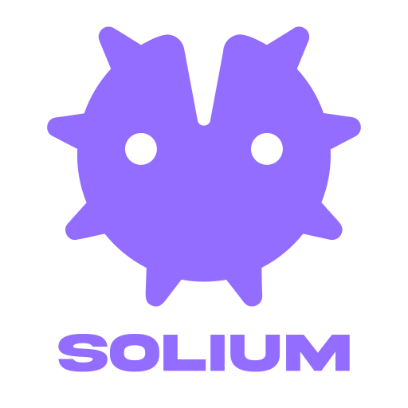
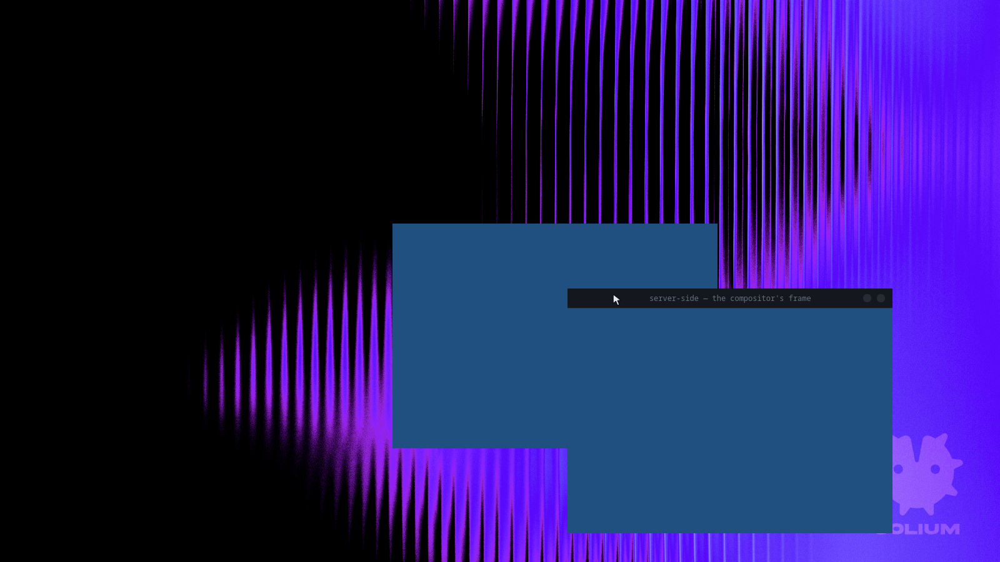

# Solium

The compositor of [Lilium DE](https://github.com/Lilium-Linux). Wayland, written
in Rust on [Smithay](https://github.com/Smithay/smithay).

One compositor for phone, tablet, laptop and desktop — tiling, scrolling,
floating and overview modes, all scriptable, all animated by the same engine.



Captured by the compositor reading back its own framebuffer. The window on the
right wears a titlebar that is QML rendered in-process and reloadable while the
session runs; the one on the left asked to draw its own and was let. The
wallpaper is drawn by the compositor too, and is a QML file you can replace.
[docs/modes.md](docs/modes.md) has the same picture for every mode, frame by
frame.

## Running it

From a free TTY (`Ctrl+Alt+F3`), and not from inside a running desktop session —
`--tty` takes the screen and will fight whatever else has it:

```sh
cargo build
./target/debug/solium --tty
```

Nested, as a window inside an existing session, for development:

```sh
./target/debug/solium
```

Three flags worth knowing:

| | |
|---|---|
| `--check` | would the configuration load? which bindings survived? |
| `--probe` | every connector and every mode it offers, without taking the screen |
| `--debug-mode` | adds the Developer Tweaks panel, on `super+shift+d` |

`super+shift+q` ends the session and `super+shift+r` reloads the configuration
without ending it. The rest of the bindings come from `--check`, because they
belong to a script rather than to the compositor.

On the hardware, anything that goes wrong is also written to
`~/.local/state/solium/session.log`, synchronously — that log exists for the
case where the screen is gone and the power button is the only way out.

## What works

Windows open, tile, scroll, float and animate. Server-side decorations are QML
and reload while the session runs. X11 clients work through XWayland. Copy and
paste works, both selections. A window's life begins when the user asks for the
application rather than when its client connects, so it takes its place in the
layout immediately and the application appears inside it.

Several monitors, each with its own display pipeline, refresh rate and layout —
one global coordinate space, arranged from the configuration or guessed left to
right. Every layout runs per screen, and the pointer crosses between them.

Protocols: `xdg-shell`, `wlr-layer-shell`, `wlr-screencopy`, `ext-session-lock`,
`ext-idle-notify`, `idle-inhibit`, `xdg-decoration`, `xdg-output`,
`xdg-activation`, `wp-viewporter`, `wp-fractional-scale`, `wp-presentation`,
`linux-dmabuf`, `relative-pointer`, `pointer-constraints`, `primary-selection`,
`xwayland-shell`. `_NET_WM_WINDOW_TYPE` is read on the X11 side, so menus and
tooltips are not managed as windows.

The desktop has a wallpaper before anything else is running, because a session
whose first frame is flat grey looks the same as a broken one. It is
`qml/wallpaper.qml` — a QML file, so it can be a gradient, a shader or a clock
instead — and a layer surface on the background layer still wins, so `swaybg`
and anything like it work unchanged.

Screenshots, recording and screen sharing all come from `wlr-screencopy`, so
`grim`, `wf-recorder` and `xdg-desktop-portal-wlr` work — which is what a
conferencing application asks the portal for.

The screen locks, through `ext-session-lock-v1`, and it fails safe: the session
is locked before the locking program has drawn anything, so there is no moment
where the desktop is still up; if that program then crashes, the screen stays
locked and blank rather than falling open. While locked nothing of the session
sees input — no bindings, no window under the pointer, no titlebars, and
`Ctrl+Alt+Backspace` will not end the session. Switching virtual terminal still
works, deliberately: whoever can press it is standing at the machine.

`ext-idle-notify` is what makes that happen on its own rather than only when
asked: `swayidle` and anything like it can run the locker after so long with
nobody at the machine. `idle-inhibit` is the other half — a video player, a
presentation or a game says "not now" and the screen stays up. An inhibitor
counts only while its window is actually drawn, so one on a workspace you are
not looking at stops holding the machine awake, and nothing at all holds it
awake behind a lock screen.

Solium does not blank or dim a screen itself; it reports idleness and leaves
the policy to whatever you run. Turning a monitor off wants
`wlr-output-power-management`, which is not here yet.

Menus behave. An X11 client that says what kind of window it is gets it: a menu
or a tooltip is placed by the application rather than tiled like a window, a Wayland popup is grabbed so clicking outside dismisses
it and constrained so it flips at a screen edge instead of running off, and a
client that draws its own decorations is clicked where it is drawn rather than
where its invisible resize shadow starts.

Not yet: an input method, so no IME and no on-screen keyboard
([#26](https://github.com/Lilium-Linux/solium/issues/26)); no clipboard manager,
which wants `data-control`
([#52](https://github.com/Lilium-Linux/solium/issues/52)); portals have never
been tested end to end
([#83](https://github.com/Lilium-Linux/solium/issues/83)). Everything known is
on the issue tracker, prioritised by whether an application can be used at all
without it rather than by how hard it is — the `daily-drive` label is that
list.

## Configuring it

Everything is a file you write, and none of it needs the compositor rebuilt.
`~/.config/solium/init.lua` holds only what you want changed; your own QML in
`~/.config/solium/qml` shadows what ships, file by file — drop in a single
`Solium/Theme.qml` and every frame and surface restyles without copying the
rest. See **[docs/ricing.md](docs/ricing.md)**.

## How it is built

Five ideas carry most of the design. Each is a choice with a cost, and the cost
is named.

### Chrome is QML, inside the compositor

Titlebars, the pointer, the wallpaper and every pane style are QML, rendered
in-process through `QQuickRenderControl` and drawn as ordinary render elements.
Not a shell talking to a compositor over a protocol — the same process, the
same frame.

That is why a titlebar can be reloaded while the session runs, why the pointer
belongs to the same theme as the window frames, and why a decoration can be a
gradient, a shader or a clock without the compositor learning what any of those
are. It is also why Qt is a hard dependency and why the render loop has to drive
Qt's animations by hand: a `Timer` in a settled QML scene never fires, because
nothing advances it but a frame the compositor decided to draw.

### A pane owns a window and its chrome

A *pane* is a window plus the layers drawn around it. Layers have a `depth` —
`behind`, `frame`, `above` — and a `bleed`, which is how far past the window's
own rectangle a layer may paint. The client is drawn between them, which is the
thing a single decoration file cannot express: a glow behind, a titlebar in
front, and the window in the middle of its own frame.

A style is a folder under `qml/panes/`, so a pane style is a bundle you can
copy, not a setting you can only choose from.

### Everything a window does is one transform

Position, size, opacity, depth and rotation pivot are one `Frame` per window per
moment, and animation is interpolation between two of them. A layout does not
move windows; it says where they should be, and the transform layer gets them
there. Which is why every mode animates identically and why a thumbnail in
overview carries its own titlebar — the frame is part of the window's transform,
not a thing drawn beside it.

### Layouts are scripts, not features

Tiling, scrolling, floating and overview are Lua. `sol.present` hands a script
the same transform the compositor uses, so a layout somebody writes is not a
second-class one. Bindings, rules and the modes themselves live there too, and
`--check` will tell you what actually loaded — because a configuration that
fails to parse leaves a compositor with no layouts and no bindings at all, and
that failure should cost a log line rather than a session.

### Effects are fragment programs with declared inputs

An effect says what it needs — nothing, its own pixels, or what is behind it —
and the compositor arranges the passes. Rounded corners are a shader over the
window's own texture, which is why they apply to the pane rather than to the
client, and why a corner radius can differ per corner so a titlebar and a window
can meet more than one way.

The renderer is reached through Smithay's `Renderer`/`Frame` traits rather than
GLES directly, so the whole transform layer stays portable to a Vulkan backend
that does not exist yet.

### And the parts that are deliberately not ours

Solium does not blank screens, manage sessions, draw a bar or own a
notification. It reports idleness and lets a policy daemon act; it exposes
`wlr-screencopy` and lets a portal record; it hosts layer surfaces and lets a
shell be a shell. [docs/shell-boundary.md](docs/shell-boundary.md) is where that
line is drawn and defended.

## Why this stack

**Smithay** is a Wayland compositor library, not a compositor. It hands over
protocol plumbing, input and backends while leaving layout, rendering and
policy to us — which is where a desktop environment's character actually lives.
[niri](https://github.com/YaLTeR/niri) is Rust-on-Smithay with working touch and
gesture support, so the multi-form-factor path has a reference implementation
rather than being a bet.

**Rust** because this codebase is meant to last. Memory safety removes an entire
class of compositor crash, and a crash in a compositor takes the session with it.

**GLES2 to start**, through Smithay's renderer traits. Smithay has no Vulkan
renderer — its `backend::vulkan` is device enumeration only — and niri, the
reference implementation we chose this stack for, uses GLES. Vulkan would mean
writing a renderer backend plus NVIDIA dmabuf import before a single window
appeared. See `docs/spikes/2026-08-27-vulkan-on-smithay.md`.

The transform layer is written against Smithay's `Renderer`/`Frame` traits, not
against GLES directly, so a Vulkan backend stays a contained change later.

## Status

Alpha. It runs on hardware and is used to develop itself, which is the only
test that counts for a compositor. It is not something to depend on yet, and
the honest reasons are specific: it has never run for a whole day
([#65](https://github.com/Lilium-Linux/solium/issues/65)), suspend and resume
have never been tested once
([#64](https://github.com/Lilium-Linux/solium/issues/64)), there are no
packaging recipes yet ([#66](https://github.com/Lilium-Linux/solium/issues/66) —
an installed copy now finds its own files, but nothing builds a package), there
is no input method at all
([#26](https://github.com/Lilium-Linux/solium/issues/26)), and a bug in here
takes the session with it.

The bugs that get found are the ones real use finds. A recent afternoon of
actually working in it turned up menus being placed by the tiling layout,
a pointer whose clicks landed 45 pixels from the cursor on any GTK or Qt
application, and windows reserving space for titlebars that were never drawn —
none exotic, none caught by the test suite, all found by opening a browser.
That is what alpha means here.

[docs/gaps.md](docs/gaps.md) is the whole list rather than the flattering part
of it.

## Documentation

| | |
|---|---|
| [docs/ricing.md](docs/ricing.md) | configuring it — start here |
| [docs/modes.md](docs/modes.md) | desktop modes, and how to write one — including per monitor |
| [docs/animation.md](docs/animation.md) | the animation engine, and how to change the feel |
| [docs/decorations.md](docs/decorations.md) | window frames and everything else drawn in QML |
| [docs/architecture.md](docs/architecture.md) | how it is built, and why |
| [docs/shell-boundary.md](docs/shell-boundary.md) | what belongs to the compositor and what to the shell |
| [docs/roadmap.md](docs/roadmap.md) | epics, in dependency order |
| [docs/beta.md](docs/beta.md) | what has to be true before a public preview |
| [docs/gaps.md](docs/gaps.md) | everything not built yet, exhaustively |
| [dev/README.md](dev/README.md) | the knobs and checks it is tested with |
| `docs/spikes/` | decisions, with the evidence that settled them |

## Thanks to

- **[Smithay](https://github.com/Smithay/smithay)** — Solium is a Smithay
  compositor, and most of what is hard about being one is Smithay's work rather
  than this project's: DRM, GBM, libinput, the seat, the protocol
  implementations. Its example compositor is also the first place to look when
  something here does not make sense.
- **[niri](https://github.com/YaLTeR/niri)** — the reference for how a serious
  Smithay compositor is actually put together, and the answer to more than one
  "surely this cannot be the way" while reading DRM code. Its scrolling layout
  is why `lua/scrolling.lua` exists to be compared against.
- **[Hyprland](https://github.com/hyprwm/Hyprland)** — where this started. Solium
  began as a Hyprland fork, and that work is archived: it proved the decoration
  and window-control ideas, and its post-mortem — including why an
  out-of-process QML shell was the wrong architecture — is in the `lilium-de`
  repository. The ideas carried over and none of the code did, but the case
  that a compositor is allowed to be beautiful and configurable at the same
  time was made there first.
- **[Quickshell](https://quickshell.outfoxxed.me/)** — the demonstration that a
  desktop shell can be QML all the way down. Solium hosts QML *inside* the
  compositor rather than beside it, which is a different answer to the same
  question, and it is a different answer because Quickshell had already shown
  what the question was.
