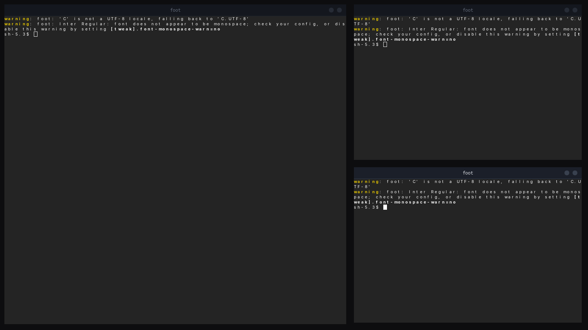

# Solium

The compositor of [Lilium DE](https://github.com/Lilium-Linux). Wayland, written
in Rust on [Smithay](https://github.com/Smithay/smithay).

One compositor for phone, tablet, laptop and desktop — tiling, scrolling,
floating and overview modes, all scriptable, all animated by the same engine.



Every titlebar above is QML rendered by the compositor and reloadable while the
session runs; the arrangement is `lua/tiling.lua` and nothing about it is
compiled in. [docs/modes.md](docs/modes.md) has the same picture for every other
mode, frame by frame.

## Running it

From a free TTY (`Ctrl+Alt+F3`), and not from inside a running desktop session —
`--tty` takes the screen and will fight whatever else has it:

```sh
cargo build
./target/debug/solium --tty
```

Nested, as a window inside an existing session, for development:

```sh
./target/debug/solium
```

Three flags worth knowing:

| | |
|---|---|
| `--check` | would the configuration load? which bindings survived? |
| `--probe` | every connector and every mode it offers, without taking the screen |
| `--debug-mode` | adds the Developer Tweaks panel, on `super+shift+d` |

`super+shift+q` ends the session and `super+shift+r` reloads the configuration
without ending it. The rest of the bindings come from `--check`, because they
belong to a script rather than to the compositor.

On the hardware, anything that goes wrong is also written to
`~/.local/state/solium/session.log`, synchronously — that log exists for the
case where the screen is gone and the power button is the only way out.

## What works

Windows open, tile, scroll, float and animate. Server-side decorations are QML
and reload while the session runs. X11 clients work through XWayland. Copy and
paste works, both selections. A window's life begins when the user asks for the
application rather than when its client connects, so it takes its place in the
layout immediately and the application appears inside it.

Several monitors, each with its own display pipeline, refresh rate and layout —
one global coordinate space, arranged from the configuration or guessed left to
right. Every layout runs per screen, and the pointer crosses between them.

Protocols: `xdg-shell`, `wlr-layer-shell`, `wlr-screencopy`, `ext-session-lock`,
`ext-idle-notify`, `idle-inhibit`, `xdg-decoration`, `xdg-output`,
`xdg-activation`, `wp-viewporter`, `wp-fractional-scale`, `wp-presentation`,
`linux-dmabuf`, `relative-pointer`, `pointer-constraints`, `primary-selection`,
`xwayland-shell`.

Screenshots, recording and screen sharing all come from `wlr-screencopy`, so
`grim`, `wf-recorder` and `xdg-desktop-portal-wlr` work — which is what a
conferencing application asks the portal for.

The screen locks, through `ext-session-lock-v1`, and it fails safe: the session
is locked before the locking program has drawn anything, so there is no moment
where the desktop is still up; if that program then crashes, the screen stays
locked and blank rather than falling open. While locked nothing of the session
sees input — no bindings, no window under the pointer, no titlebars, and
`Ctrl+Alt+Backspace` will not end the session. Switching virtual terminal still
works, deliberately: whoever can press it is standing at the machine.

`ext-idle-notify` is what makes that happen on its own rather than only when
asked: `swayidle` and anything like it can run the locker after so long with
nobody at the machine. `idle-inhibit` is the other half — a video player, a
presentation or a game says "not now" and the screen stays up. An inhibitor
counts only while its window is actually drawn, so one on a workspace you are
not looking at stops holding the machine awake, and nothing at all holds it
awake behind a lock screen.

Solium does not blank or dim a screen itself; it reports idleness and leaves
the policy to whatever you run. Turning a monitor off wants
`wlr-output-power-management`, which is not here yet.

Not yet: IME. Everything known is on the issue tracker, prioritised by whether
an application can be used at all without it rather than by how hard it is.

## Configuring it

Everything is a file you write, and none of it needs the compositor rebuilt.
`~/.config/solium/user.lua` holds only what you want changed; your own QML
shadows what ships, file by file. See **[docs/ricing.md](docs/ricing.md)**.

## Why this stack

**Smithay** is a Wayland compositor library, not a compositor. It hands over
protocol plumbing, input and backends while leaving layout, rendering and
policy to us — which is where a desktop environment's character actually lives.
[niri](https://github.com/YaLTeR/niri) is Rust-on-Smithay with working touch and
gesture support, so the multi-form-factor path has a reference implementation
rather than being a bet.

**Rust** because this codebase is meant to last. Memory safety removes an entire
class of compositor crash, and a crash in a compositor takes the session with it.

**GLES2 to start**, through Smithay's renderer traits. Smithay has no Vulkan
renderer — its `backend::vulkan` is device enumeration only — and niri, the
reference implementation we chose this stack for, uses GLES. Vulkan would mean
writing a renderer backend plus NVIDIA dmabuf import before a single window
appeared. See `docs/spikes/2026-08-27-vulkan-on-smithay.md`.

The transform layer is written against Smithay's `Renderer`/`Frame` traits, not
against GLES directly, so a Vulkan backend stays a contained change later.

## Status

Alpha. It runs on hardware and is used to develop itself, which is the only
test that counts for a compositor. It is not something to depend on yet, and
the honest reasons are: the keyboard layout cannot be changed from US QWERTY
([#53](https://github.com/Lilium-Linux/solium/issues/53)), a monitor plugged in
mid-session is not picked up
([#43](https://github.com/Lilium-Linux/solium/issues/43)), suspend and resume
have never been tested once
([#64](https://github.com/Lilium-Linux/solium/issues/64)), there is no way to
install it ([#66](https://github.com/Lilium-Linux/solium/issues/66)), and a bug
in here takes the session with it.

[docs/gaps.md](docs/gaps.md) is the whole list rather than the flattering part
of it.

## Documentation

| | |
|---|---|
| [docs/ricing.md](docs/ricing.md) | configuring it — start here |
| [docs/modes.md](docs/modes.md) | desktop modes, and how to write one — including per monitor |
| [docs/animation.md](docs/animation.md) | the animation engine, and how to change the feel |
| [docs/decorations.md](docs/decorations.md) | window frames and everything else drawn in QML |
| [docs/architecture.md](docs/architecture.md) | how it is built, and why |
| [docs/shell-boundary.md](docs/shell-boundary.md) | what belongs to the compositor and what to the shell |
| [docs/roadmap.md](docs/roadmap.md) | epics, in dependency order |
| [docs/beta.md](docs/beta.md) | what has to be true before a public preview |
| [docs/gaps.md](docs/gaps.md) | everything not built yet, exhaustively |
| [dev/README.md](dev/README.md) | the knobs and checks it is tested with |
| `docs/spikes/` | decisions, with the evidence that settled them |

## Thanks to

- **[Smithay](https://github.com/Smithay/smithay)** — Solium is a Smithay
  compositor, and most of what is hard about being one is Smithay's work rather
  than this project's: DRM, GBM, libinput, the seat, the protocol
  implementations. Its example compositor is also the first place to look when
  something here does not make sense.
- **[niri](https://github.com/YaLTeR/niri)** — the reference for how a serious
  Smithay compositor is actually put together, and the answer to more than one
  "surely this cannot be the way" while reading DRM code. Its scrolling layout
  is why `lua/scrolling.lua` exists to be compared against.
- **[Hyprland](https://github.com/hyprwm/Hyprland)** — where this started. Solium
  began as a Hyprland fork, and that work is archived: it proved the decoration
  and window-control ideas, and its post-mortem — including why an
  out-of-process QML shell was the wrong architecture — is in the `lilium-de`
  repository. The ideas carried over and none of the code did, but the case
  that a compositor is allowed to be beautiful and configurable at the same
  time was made there first.
- **[Quickshell](https://quickshell.outfoxxed.me/)** — the demonstration that a
  desktop shell can be QML all the way down. Solium hosts QML *inside* the
  compositor rather than beside it, which is a different answer to the same
  question, and it is a different answer because Quickshell had already shown
  what the question was.
