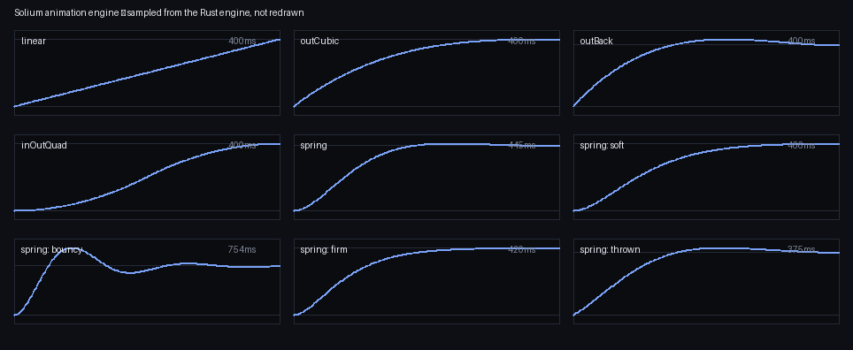

# Animation

There is one animation engine and one clock. Every window that moves — a tiling
rearrangement, entering overview, a window opening, a genie into a dock icon —
moves through the same code. That is not tidiness: it is why modes cannot
animate inconsistently with each other, which is the usual way a desktop ends
up feeling assembled rather than designed.

## The shape of it

An animation is a **duration** and a **curve**, and it is set on the batch
rather than on the window:

```lua
sol.animate({ duration = 240, easing = "outCubic" })
sol.place(a.id, slot_a)
sol.place(b.id, slot_b)
sol.place(c.id, slot_c)
```

Everything queued after `sol.animate` uses it. Three windows rearranging is one
movement over one interval on one clock — set the feel per window and you get
three animations that happen to overlap, which looks like it.

`duration` is milliseconds. Leave either key out and that half keeps what it
had.

## Curves



Sampled from the engine itself rather than drawn to illustrate it, so what is
plotted is what runs — including the durations, which for a spring are an
outcome rather than a setting.

Five have names:

| name | |
|---|---|
| `linear` | no easing; for things that should look mechanical |
| `outCubic` | fast start, soft landing — the default, and right most of the time |
| `outBack` | overshoots slightly and settles back; for things *appearing* |
| `inOutQuad` | slow at both ends; for things that *move* rather than appear |
| `spring` | physical, and settles when it settles rather than on a schedule |

The distinction between `outBack` and `inOutQuad` is the one worth internalising.
A window arriving wants a little overshoot — it reads as landing. A window
travelling from one place to another wants easing at both ends — overshoot on
something that was already on screen reads as a wobble.

`spring` ignores `duration` entirely; a spring arrives when it arrives. Its
parameters (stiffness, damping, mass, initial velocity) are not settable from
Lua yet — you get the default, which settles in a little over a third of a
second with a small overshoot. A gesture's throw speed belongs in its initial
velocity and that is why the parameter exists; wiring it to a real gesture is
E7's work.

## Any curve at all

Four numbers instead of a name, and they are the two control points of a cubic
bezier from (0,0) to (1,1):

```lua
sol.animate({ duration = 220, easing = { 0.34, 1.56, 0.64, 1 } })
```

These are exactly the four numbers CSS calls `cubic-bezier`, so a feel you found
on any easing site transfers directly by pasting it. The named curves above are
the ones worth a name; this exists so that a feel nobody anticipated does not
need a compositor release.

`y` may leave 0..1 — that is what overshoot *is*. `x` is clamped to 0..1,
because x outside that is not a curve a clock can walk along: time would have to
run backwards to reach it.

Give it something that is neither a name nor four numbers and it warns and keeps
the default rather than failing. Give it an unknown name and the same. A wrong
easing should cost you a line in the log, not the session.

## Where the feel actually lives

Almost none of it should be in your mode. `config.lua` declares it, and your
mode reads it:

```lua
tiling = {
    motion = { duration = 240, easing = "outCubic" },
    -- The shorter feel for a window snapping back after a drag.
    snap = { duration = 180, easing = "outCubic" },
},
scrolling = {
    motion = { duration = 260, easing = "outCubic" },
    snap = { duration = 200, easing = "outCubic" },
},
workspaces = { motion = { duration = 300, easing = "outCubic" } },
dock      = { morph  = { duration = 340, easing = "outCubic" } },
open      = { motion = { duration = 200, easing = "outCubic" }, scale = 0.92 },
loading   = { fade = 180 },
```

So changing how tiling feels is one line in `~/.config/solium/user.lua`:

```lua
return { tiling = { motion = { duration = 160, easing = "outBack" } } }
```

A mode that hardcodes its own durations is a mode nobody can tune, which is the
whole reason these are here rather than in the Lua that uses them. `tiling.lua`
takes `config.tiling.motion` and passes it straight to `sol.animate`; that is
the pattern to copy.

Two of them are worth explaining because the *reason* for the number is not
obvious:

- **`snap` is shorter than `motion`.** A window returning after a drag is
  answering something you just did with your hand, and a long animation there
  reads as lag rather than polish.
- **`dock.morph` is longer than everything.** The distance travelled is the
  thing being shown, so it gets time to be seen.

## Animations you should not write

Some things must not be animated, and the reasons are worth knowing before you
try:

**A resize you are dragging.** `resize.rs` says it in a comment: the window has
to be under the pointer's corner *this frame*. An animation puts it where the
pointer was a hundred milliseconds ago, which reads as lag rather than as
polish. `tiling.lua` passes `{ duration = 0 }` while a seam is being dragged for
exactly this reason. Animate motion the user did not personally drag.

**A locked pointer.** Nothing to animate — the cursor does not move at all,
which is the point of a lock.

**A scene fading itself out.** The dissolve from a loading window to its
application is the compositor's, not the scene's, and a QML scene *cannot* do it
for itself: Qt's software renderer repaints only what it thinks changed, onto the
pixels already there, so each half-transparent frame lands on its own opaque
previous one and nothing fades. `loading.fade` is the setting.

## What it costs

Drawing is damage-driven: a still screen draws nothing at all. An animation
therefore has to *ask* for the next frame, and everything in the engine does —
but it means an animation that never ends is a compositor that never idles.
`pulse.qml` animates continuously while focused and opts out of idling for as
long as it does. That is a fair trade you are making knowingly; making it by
accident is not.

The clock is read fresh rather than sampled once per frame, and there is a test
asserting so. That is not an optimisation, it is a correctness property: a
cached clock froze whenever the screen was still, so a binding pressed after a
quiet minute started its animation a minute in the past and was already finished
by the time anything drew it. Animations that work only if you have been doing
something are worse than none.

See also: **[modes.md](modes.md)** for what to animate,
**[ricing.md](ricing.md)** for the settings file.
