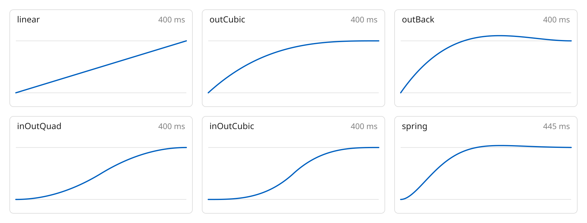

# Animation

There is one animation engine and one clock. Every window that moves — a tiling
rearrangement, entering overview, a window opening or closing, the genie
`super+m` plays — moves through the same code. That is not tidiness: it is why
modes cannot animate inconsistently with each other, which is the usual way a
desktop ends up feeling assembled rather than designed.

## The shape of it

An animation is a **duration** and a **curve**, and it is set on the batch
rather than on the window:

```lua
sol.animate({ duration = 240, easing = "outCubic" })
sol.place(a.id, slot_a)
sol.place(b.id, slot_b)
sol.place(c.id, slot_c)
```

Everything queued after `sol.animate` uses it. Three windows rearranging is one
movement over one interval on one clock — set the feel per window and you get
three animations that happen to overlap, which looks like it.

`duration` is milliseconds. Leave either key out and that half keeps what it
had.

## Curves



Sampled from the engine itself rather than drawn to illustrate it, so what is
plotted is what runs: each panel is `Curve::at` from `crates/animation`, for
every curve `Curve::all()` names. The five with a fixed shape are drawn over
400 ms, and would take whatever duration they are given; the spring is drawn
over the 445 ms `Spring::settle_time` says it takes, which for a spring is an
outcome rather than a setting. `dev/preview` plots any of them live from the
same engine, one at a time, and is the thing to reach for.

Six have names:

| name | |
|---|---|
| `linear` | no easing; for things that should look mechanical |
| `outCubic` | fast start, soft landing — the default, and right most of the time |
| `outBack` | overshoots slightly and settles back; for things *appearing* |
| `inOutQuad` | slow at both ends; for things that *move* rather than appear |
| `inOutCubic` | the same, harder: a longer wind-up and settle, which reads as weight |
| `spring` | physical, and settles when it settles rather than on a schedule |

The distinction between `outBack` and `inOutQuad` is the one worth internalising.
A window arriving wants a little overshoot — it reads as landing. A window
travelling from one place to another wants easing at both ends — overshoot on
something that was already on screen reads as a wobble.

`inOutCubic` is `inOutQuad` with more of both ends: it holds back longer at each
and crosses the middle faster. Reach for it when the distance *is* the point —
the `super+m` genie pulls a window across most of the screen into a strip at
its bottom edge, and wants to feel like it — and for `inOutQuad` when a window
is only moving between two slots.

`spring` ignores `duration` entirely; a spring arrives when it arrives. Its
parameters (stiffness, damping, mass, initial velocity) are not settable from
Lua yet — you get the default, which settles in a little under half a second
(445 ms) with a small overshoot. A gesture's throw speed belongs in its initial
velocity and that is why the parameter exists; wiring it to a real gesture is
E7's work.

## Any curve at all

Four numbers instead of a name, and they are the two control points of a cubic
bezier from (0,0) to (1,1):

```lua
sol.animate({ duration = 220, easing = { 0.34, 1.56, 0.64, 1 } })
```

These are exactly the four numbers CSS calls `cubic-bezier`, so a feel you found
on any easing site transfers directly by pasting it. The named curves above are
the ones worth a name; this exists so that a feel nobody anticipated does not
need a compositor release.

`y` may leave 0..1 — that is what overshoot *is*. `x` is clamped to 0..1,
because x outside that is not a curve a clock can walk along: time would have to
run backwards to reach it.

Give it something that is neither a name nor four numbers and it warns and keeps
the default rather than failing. Give it an unknown name and the same. A wrong
easing should cost you a line in the log, not the session.

## Where the feel actually lives

Almost none of it should be in your mode. `config.lua` declares it, and your
mode reads it:

```lua
tiling = {
    motion = { duration = 240, easing = "outCubic" },
    -- The shorter feel for a window snapping back after a drag.
    snap = { duration = 180, easing = "outCubic" },
},
scrolling = {
    motion = { duration = 260, easing = "outCubic" },
    snap = { duration = 200, easing = "outCubic" },
},
workspaces = { motion = { duration = 300, easing = "outCubic" } },
open      = { motion = { duration = 220, easing = "outBack" }, scale = 0.88 },
loading   = { fade = 180 },
```

These are the numbers `config.lua` really has. The block used to print `open` as
200 / `outCubic` / 0.92 and to carry a `dock = { morph = ... }` line, and #117
deleted both from `config.lua` for the same reason: nothing read either of them.
`open.lua` held 220 / `outBack` / 0.88 as local constants, so the advertised
numbers described an animation nobody had ever seen, and the script's won when
the two were wired together — those are what the animation was tuned against.
There is no dock, so `dock.morph` configured a component that does not exist,
and `--check` now reports that spelling as an unrecognised key.

So changing how tiling feels is one line in `~/.config/solium/user.lua`:

```lua
return { tiling = { motion = { duration = 160, easing = "outBack" } } }
```

A mode that hardcodes its own durations is a mode nobody can tune, which is the
whole reason these are here rather than in the Lua that uses them. `tiling.lua`
takes `config.tiling.motion` and passes it straight to `sol.animate`; that is
the pattern to copy.

Two of them are worth explaining because the *reason* for the number is not
obvious:

- **`snap` is shorter than `motion`.** A window returning after a drag is
  answering something you just did with your hand, and a long animation there
  reads as lag rather than polish.
- **`open` overshoots, and is the only one that does.** `outBack` goes past the
  window's real size and settles back, which is why it starts at 0.88 rather
  than nearer 1 — a small overshoot needs somewhere to have come from.

## Closing

A window you close shrinks to 0.86 of its size and fades out over 190 ms, on
`inOutQuad` (`present::CLOSING`). The compositor plays that before it tells the
application to close, so the window can still paint while it goes, and by
default the layout moves the other windows into its place at once
(`reflow_on_close`; [modes.md](modes.md) has the events). A window whose own
application closes it fades the same way, from the last picture it drew
(#126), and so does a loading window whose application never arrives, once
`loading.patience` runs out.

An application can refuse: by saying nothing for a second after it is asked,
or by answering with a dialog. Then the window comes back. A layout that puts
it back moves it over the layout's own duration; if nothing places it, it fades
back in where it vanished over 150 ms, on `outCubic`.

None of these numbers is in `config.lua` yet, so none can be tuned: they are
the exception to the rule above, and so are overview's 260 and 200 ms, which
live in `overview.lua`.

## Animations you should not write

Some things must not be animated, and the reasons are worth knowing before you
try:

**A resize you are dragging.** `input/resize.rs` says it in a comment: the
window has to be under the pointer's corner *this frame*. An animation puts it
where the pointer was a hundred milliseconds ago, which reads as lag rather
than as polish. `tiling.lua` passes `{ duration = 0 }` while a seam is being
dragged for exactly this reason. Animate motion the user did not personally
drag.

**A locked pointer.** Nothing to animate — the cursor does not move at all,
which is the point of a lock.

**A scene fading itself out.** The dissolve from a loading window to its
application is the compositor's, not the scene's. Whether a window is
see-through is a presentation transform, like where it is and how big, so the
compositor applies it to the scene's picture as it draws it. On the software
renderer a scene could not do it anyway: Qt repaints only what it thinks
changed, onto the pixels already there, so each half-transparent frame lands on
its own opaque previous one and nothing fades. `loading.fade` is the setting.

## What it costs

Drawing is damage-driven: a still screen draws nothing at all. An animation
therefore has to *ask* for the next frame, and everything in the engine does —
but it means an animation that never ends is a compositor that never stops
drawing. The `pulse` pane style animates continuously while its window is
focused, and keeps the compositor drawing for as long as it does. That is a
fair trade you are making knowingly; making it by accident is not.

The clock is read fresh rather than sampled once per frame, and there is a test
asserting so. That is not an optimisation, it is a correctness property: a
cached clock froze whenever the screen was still, so a binding pressed after a
quiet minute started its animation a minute in the past and was already finished
by the time anything drew it. Animations that work only if you have been doing
something are worse than none.

See also: **[modes.md](modes.md)** for what to animate,
**[ricing.md](ricing.md)** for the settings file.
