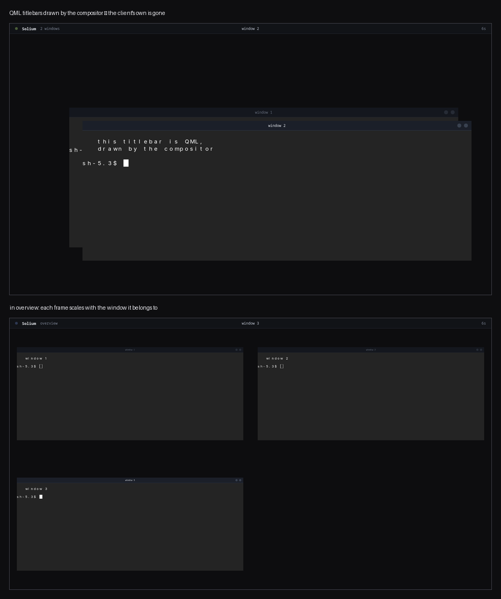
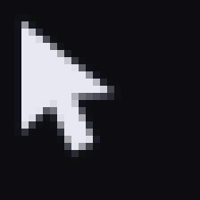

# Decorations, and other things the compositor draws

Everything the compositor draws that is not a client's window is QML, hosted
in-process. Window frames, the pointer, the loading window, the shell itself.
There is nothing to compile and no Rust to touch: write a file, name it, press
`super+shift+r`.

The property-by-property contract for a frame lives next to the frames, at
[`crates/solium/qml/decorations/README.md`](../crates/solium/qml/decorations/README.md).
This is the guide: what the pieces are, how to write one, and what it costs.



Both halves are the same QML. In overview each frame scales with the window it
belongs to rather than being redrawn at a new size, because a frame is part of
the window as far as the transform layer is concerned — which is why a mode can
scale a window at all without knowing what a titlebar is.



The pointer is the same story in miniature: not an image loaded from a cursor
theme, but QML rasterised by the compositor, so it belongs to the same design
system as the frames. See [#81](https://github.com/Lilium-Linux/solium/issues/81)
for what that costs — there is no way yet to make it match the theme every
other application on the machine follows.

## The four kinds

| what | where | named by |
|---|---|---|
| window frames | `qml/decorations/*.qml` | `decoration = "top"` |
| the loading window | `qml/loading/*.qml` | `loading = { scene = "window" }` |
| the pointer | `qml/cursor.qml` | `SOLIUM_QML_CURSOR` |
| a shell (bar, dock) | anywhere | `SOLIUM_SHELL_SCENE` |

Your own directory is `~/.config/solium/qml/`, and it is searched first in
every case. A file you write shadows the shipped one of the same name, and
everything you did not write still comes from the shipped set — including its
later improvements. That is the whole mechanism; there is no manifest and
nothing to register.

## Writing a frame

Start from `border.qml`. It is the smallest useful decoration and every other
one is it plus something:

```qml
import QtQuick
import Solium

Item {
    id: frame

    // What it reserves. The client is placed inside what is left.
    property int insetTop: 3
    property int insetRight: 3
    property int insetBottom: 3
    property int insetLeft: 3

    // Set by the compositor every frame.
    property string title: ""
    property bool focused: false
    property bool pointerInside: false
    property int contentWidth: 0
    property int contentHeight: 0

    // Read by the compositor.
    property string action: ""
    property string hovered: ""

    Rectangle {
        anchors.fill: parent
        color: "transparent"        // the client shows through
        radius: 6
        border {
            width: frame.insetTop
            color: frame.focused ? Theme.accent : Theme.edgeInactive
        }
        Behavior on border.color { ColorAnimation { duration: Theme.normal } }
    }
}
```

Four things about that are the whole model.

**The root covers the window's entire outer rect** — frame and client together,
not a strip at the top. Whatever you do not paint stays transparent and the
client shows through. That is why a bar can be on any side, or there can be no
bar at all, or a bar that floats over the window and reserves nothing.

**The insets are what you reserve**, read once when the frame is built. Reserve
nothing and your decoration becomes an overlay: it draws on top of the client
and never moves it.

**`focused` and `pointerInside` are given to you every frame**, so reacting to
focus or to the cursor is a binding rather than a subscription. `pointerInside`
is true while the pointer is anywhere over the window, *including over the
client* — which is how a border can follow a cursor that is over a text editor.

**`action` is how you ask for something.** Set it to `"close"` or `"maximize"`;
the compositor takes it and clears it, so a press is acted on once.

## The one trap

`hovered` decides whether a press starts a window drag. A decoration whose
buttons do not set it will have its buttons dragging the window instead of
pressing — which looks like the buttons being broken rather than like a missing
property.

```qml
MouseArea {
    anchors.fill: parent
    hoverEnabled: true
    onEntered: frame.hovered = "close"
    onExited: if (frame.hovered === "close") frame.hovered = ""
    onClicked: frame.action = "close"
}
```

## Sizes are logical, always

A frame is laid out in **logical** pixels and rasterised at whatever its
monitor's scale is. `insetTop: 3` is three logical pixels on a 1x screen and
six real ones on a 2x screen, and `Theme.fontSize` behaves the same way.

Nothing is required of you for that to work, and that is the point: there is no
scale property to read and no arithmetic to do. It is worth knowing only so
that you do not try. A frame that multiplied its own sizes by a scale would be
twice as big as it asked to be, and a frame that hardcoded device pixels would
be a different size on each monitor.

The compositor rasterises the scene at `logical × scale` and hands Qt the ratio
between the two, so a titlebar on a HiDPI screen gets more detail rather than
more blur. Test it with `SOLIUM_OUTPUTS=2` and a scale on one of them; see
[dev/README.md](../dev/README.md).

## Colours and fonts

Nothing in a frame should contain a hex code. `Solium.Theme` has them:

`surface`, `surfaceInactive`, `surfaceSunken`, `edge`, `edgeInactive`, `text`,
`textDim`, `accent`, `positive`, `warning`, `danger`, `control`,
`controlInactive`, and the metrics `titlebarHeight`, `radius`, `gap`, `margin`,
`fontFamily`, `fontSize`, `quick`, `normal`.

Copy `Solium/Theme.qml` into `~/.config/solium/qml/Solium/` and change it, and
every frame, the pointer, the loading window and the shell follow — one file
restyles the desktop rather than the titlebars. A frame that hardcodes a colour
is a frame that stops matching the moment anyone changes anything.

## Animation inside a frame

Nothing to declare. Qt is asked each frame whether the scene has anything new,
and the compositor draws only then — so an idle frame costs a flag read, a
transition runs at the screen's refresh rate, and a loop with a pause in it
survives the pause.

Two things to know before you animate:

**A frame that never stops animating never stops costing anything.** It is
rasterised on the CPU: a full-width gradient moving at 260 Hz is about a tenth
of a core. `pulse.qml` does that deliberately while focused. Making that trade
knowingly is fine; making it by accident is not.

**Stay inside your own bands if you can.** A frame that paints only where it
reserved space has only those bands copied and uploaded when it changes — a
titlebar is around 4% of a window, and copying the other 96% every frame is
most of what an animating decoration costs. If you reserve space *and* paint
outside it, say so with `property bool overlay: true`, which opts out of that
optimisation. Usually the better answer is to reserve the couple of pixels you
were painting over.

## The loading window

The other scene worth writing. It is what is inside a window between the user
asking for an application and the application existing — and the window is
already real by then: it has its slot, the other windows have moved aside, it
can be closed.

It is handed `program` and `waited`. The one that ships uses only the name, on
the grounds that the window already *is* the window, and the one fact you do not
otherwise have is which application you are waiting for.

```qml
import QtQuick
import Solium

Item {
    id: card
    property string program: ""
    property int waited: 0

    Rectangle {
        anchors.fill: parent
        color: Theme.surface
        Text {
            anchors.centerIn: parent
            text: card.program
            color: Theme.text
            font { pixelSize: Theme.fontSize + 8; family: Theme.fontFamily }
        }
    }
}
```

**Do not fade it out yourself when the application arrives.** The compositor
does that, over `loading.fade`, and a scene *cannot* do it for itself: Qt's
software renderer repaints only what it thinks changed, onto the pixels already
there, so each half-transparent frame lands on its own opaque previous one and
nothing fades at all. This is not a rule of thumb — it is a thing that was
tried, and the first attempt was a hard cut with one stray frame in it.

## Trying things quickly

```sh
SOLIUM_DECORATION=left ./target/debug/solium     # one run, one decoration
SOLIUM_LOADING=mine    ./target/debug/solium     # one run, one loading scene
solium --check-qml path/to/thing.qml             # does it even load?
```

`--check-qml` loads one file and says what went wrong without starting a
compositor. Porting a scene means walking a chain of "type X unavailable"
errors, and doing that through a real session costs ten seconds a link.

`super+shift+r` in a running session reads the configuration again, drops the
QML cache and rebuilds every frame. Windows keep their slots and each client is
resized to whatever the new decoration left it — so a frame can be written
against a desktop you are using.

With `--debug-mode`, `super+shift+d` opens a panel that switches decoration,
transform and morph live. It is a development tool and will not be here
forever, but while it is, it is the fastest way to see eight decorations in
eight seconds.

## What ships

| file | |
|---|---|
| `top.qml` | a titlebar above the window — the default |
| `left.qml` | a vertical titlebar down the left side |
| `bottom.qml` | a titlebar underneath |
| `border.qml` | no bar, just a frame — read this one first |
| `reactive.qml` | a border that lights where the cursor is, with a bar |
| `proximity.qml` | a border that answers the pointer arriving and leaving |
| `reveal.qml` | a bar that slides out of the window's edge on approach |
| `pulse.qml` | a bar with an animation running in it |

See also: **[ricing.md](ricing.md)** for the settings,
**[animation.md](animation.md)** for the engine that moves the windows these
are drawn around, **[shell-boundary.md](shell-boundary.md)** for what belongs
to a shell rather than to the compositor.
