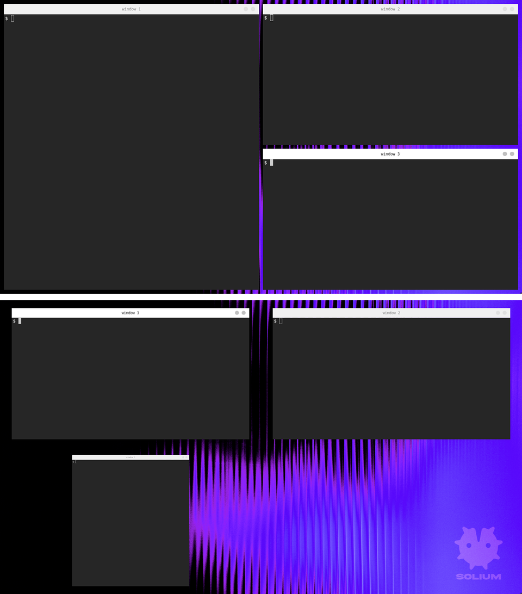
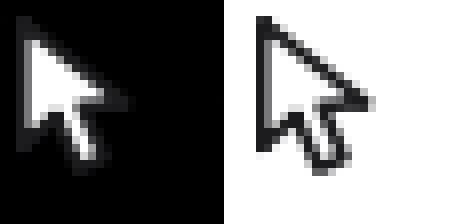

# Decorations, and other things the compositor draws

Most of what the compositor draws that is not a client's window is QML, hosted
in-process: the window frames, the loading window, the wallpaper, a shell you
name in the configuration, any other scene a script declares, and the pointer
when a scene of your own is named for it or no cursor theme is set (see
[shell-boundary.md](shell-boundary.md) for the shell). There is nothing to
compile and no Rust to touch: write a file, name it, press `super+shift+r`.

Two things on screen are not QML: a pointer from an XCursor theme, which is
the theme's own picture, and the rounded corners cut into a client, which are
a fragment program the compositor runs over the client's pixels.

The property-by-property contract for a frame lives next to the styles, at
[`crates/solium/qml/panes/README.md`](../crates/solium/qml/panes/README.md),
and so does the one list of the styles that ship. This is the guide: what the
pieces are, how to write one, and what it costs.



*Three terminals tiled, in the default `top` style over the default wallpaper:
the focused window's titlebar is white, the other two light grey. Below, the
same three in overview. Taken under the light theme Solium shipped until
2026-10-04 and not retaken yet: the shipped theme is now dark grey, the focused
titlebar a shade lighter than the others ([Colours and
fonts](#colours-and-fonts)).* Both halves are the same QML. In overview each
frame scales with the window it belongs to rather than being redrawn at a new
size, because a frame is part of the window as far as the transform layer is
concerned, which is why a mode can scale a window at all without knowing what a
titlebar is.

## What is QML, and where it comes from

| what | shipped as | named by |
|---|---|---|
| window frames | `qml/panes/<name>/` | `pane = "top"` |
| the loading window | `qml/loading/*.qml` | `loading = { scene = "window" }` |
| the wallpaper | `qml/wallpaper.qml` | `wallpaper = ...` (see [ricing.md](ricing.md)) |
| a shell (bar, dock, launcher) | nothing ships | `shell = { scene = ... }` |
| the keyboard pill, on a surface of its own | `qml/indicator/keyboard.qml` | `keyboard.indicator` in `config.lua` (`lua/keyboard_indicator.lua` declares it through `sol.surface`) |
| any other scene | `qml/tweaks.qml`, the Developer Tweaks panel (`--debug-mode` only) | `sol.surface(name, { scene = ... })` |
| the pointer, with no scene and no cursor theme | `qml/cursor.qml` | not replaced; name a scene instead |
| the pointer's scene | nothing ships | `cursor = { scene = ... }`, or `SOLIUM_QML_CURSOR` for one run |

Your own directory is `~/.config/solium/qml/`, and for everything in that
table but the pointer it is searched first. A file you write shadows the
shipped one of the same name, and everything you did not write still comes
from the shipped set, including its later improvements. A folder under
`panes/` counts only if it has a `Pane.qml` in it, so an empty one does not
replace the shipped style of that name. There is no registry: nothing has to
be listed anywhere for a style to be found.

The shipped pointer is the exception: `~/.config/solium/qml/cursor.qml` does
not replace it. A pointer of your own is a scene you name, which a bare name
finds in that directory first. [The pointer](#the-pointer) below says how.

## Writing a pane style

A style is a folder. `Pane.qml` is its manifest: what the frame reserves from
the client, and a list of layers. Each layer is its own QML scene, drawn at
its own depth: `behind` the client, in the `frame` (over the client), or
`above` the frame. `panes/border/` is the smallest, and the one to read first:

```qml
// panes/border/Pane.qml
import QtQuick
import Solium

PaneStyle {
    insets.top: 3
    insets.right: 3
    insets.bottom: 3
    insets.left: 3

    requires: []

    Layer { depth: "frame"; name: "border"; source: "Frame.qml" }
    KeyboardPillLayer {}
}
```

The last line is the keyboard pill every shipped style draws at the focused
text field's caret; leave it out and the style draws none (the panes README,
"The keyboard pill").

```qml
// panes/border/Frame.qml, shortened
import QtQuick
import Solium

Item {
    id: frame

    property int insetTop: 0         // set by the compositor, from Pane.qml
    property bool focused: false     // set by the compositor

    Rectangle {
        anchors.fill: parent
        color: "transparent"         // the client shows through
        border {
            width: frame.insetTop
            color: frame.focused ? Theme.accent : Theme.edgeInactive
        }
        Behavior on border.color { ColorAnimation { duration: Theme.normal } }
    }
}
```

Five things about that are the whole model.

**A layer's root covers the window's entire outer rect**, frame and client
together, not a strip at the top. Whatever it does not paint stays transparent
and the client shows through. That is why a bar can be on any side, or there
can be no bar at all. A layer that declares `bleed` gets a larger canvas, the
window grown by that much, and `bleedLeft` and `bleedTop` say where the window
is inside it.

**The insets are what the style reserves**, declared once on the manifest,
and the compositor hands the same four numbers to every layer as `insetTop`,
`insetRight`, `insetBottom` and `insetLeft`. Reserve nothing and the style
becomes an overlay: it draws over the client and never moves it.

**`focused`, `pointerInside`, `title` and the sizes are written for you** when
they change, so reacting to focus or to the cursor is a binding rather than a
subscription. `pointerInside` is true while the pointer is anywhere over the
window, *including over the client*, which is how a border can follow a cursor
that is over a text editor. So are `caret`, where the focused text field's
caret is when this window has it, and `values`, whatever the configuration
handed every pane with `sol.pane_values{ ... }`; the `Keyboard` singleton is
there to read as well. The panes README says what each holds.

**`action` is how a button asks for something.** Set it to `"close"` or
`"maximize"`; the compositor takes it and clears it, so a press is acted on
once, on release.

**`onButton` is how a button keeps a press from dragging the window.** A press
on the frame starts a window move unless a layer says the pointer is over a
button, and the property the compositor reads for that is a boolean called
`onButton`. The shipped `top` style keeps it next to the name of the button
under the pointer:

```qml
property string hovered: ""                       // which button, or ""
readonly property bool onButton: hovered !== ""   // what the compositor reads

MouseArea {
    anchors.fill: parent
    hoverEnabled: true
    onContainsMouseChanged: frame.hovered = containsMouse ? "close" : ""
    onClicked: frame.action = "close"
}
```

A layer whose buttons do not declare `onButton` has its buttons drag the
window instead of pressing, which looks like broken buttons rather than like a
missing property. `hovered` on its own is not read by anything. Five of the
shipped styles with buttons, `left`, `bottom`, `pulse`, `reactive` and
`reveal`, declare `hovered` and not `onButton`, so their buttons may not press
([#158](https://github.com/Lilium-Linux/solium/issues/158)). `top` is the one
to copy.

Two more things a style author meets. Presses reach a layer only inside the
band the insets reserve; hover goes everywhere, presses do not, so a button
drawn over the client or out in the bleed cannot be clicked. And a tiled
window can be small: the shipped bars hide the title, then their buttons, when
there is no room for them (#133), and a style of yours should plan for a small
`paneWidth` too.

The full list of what a layer is told and what is read back, `depth` and
`bleed` in detail, and `client.radius` for rounding the client itself, are in
the [panes README](../crates/solium/qml/panes/README.md).

One QML file with an `Item` at its root is still a style, called a
decoration: put it in `~/.config/solium/qml/decorations/` and name it. It is
one `frame` layer, and it declares its own `insetTop` and the rest, because it
has no manifest. A bundle is found first, so a file there named like a shipped
style (`top.qml`) never draws; give it a name of its own.

## Sizes are logical, always

A frame is laid out in **logical** pixels and rasterised at whatever its
monitor's scale is. `insets.top: 3` is three logical pixels on a 1x screen and
six real ones on a 2x screen, and `Theme.fontSize` behaves the same way.

Nothing is required of you for that to work, and that is the point: there is no
scale property to read and no arithmetic to do. It is worth knowing only so
that you do not try. A frame that multiplied its own sizes by a scale would be
twice as big as it asked to be, and a frame that hardcoded device pixels would
be a different size on each monitor.

The compositor rasterises the scene at `logical × scale` and hands Qt the ratio
between the two, so a titlebar on a HiDPI screen gets more detail rather than
more blur. Test it with `SOLIUM_OUTPUTS=2` and a scale on one of them; see
[dev/README.md](../dev/README.md).

## Colours and fonts

Nothing in a frame should contain a hex code. `Solium.Theme` has nineteen
properties:

- colours: `surface`, `surfaceInactive`, `edge`, `edgeInactive`, `text`,
  `textDim`, `control`, `controlInactive`, `accent`, `warning`, `danger`,
  `accentInk` (what is drawn on the last three);
- metrics: `titlebarHeight`, `gap`, `margin`;
- type: `fontFamily`, `fontSize`;
- chrome durations, in milliseconds: `quick`, `normal`.

The frames, the loading window, the keyboard pill and a hosted shell that
imports `Solium` all read that one singleton, so a colour changed there changes
all of them.

**The shipped colours are greys, every one: red, green and blue the same.**
That is the maintainer's decision for now: a dark theme in black, greys and
white, with no accent hue and none of the logo's or the wallpaper's colours.
The bars are near-black, the focused one a shade lighter, with light grey
titles, dimmer on the windows without the keyboard; `accent` is a light grey,
which the keyboard pill's capsule is drawn in; and `warning` and `danger`,
which the maximise and close buttons turn under the pointer, are two greys
told apart by shade and by the glyph each then shows. A light scheme, or
colour accents, would be a change of the values only: the names stay.
`qml::hosting_tests::every_colour_the_theme_publishes_is_a_grey` holds the
shipped file to it. And a grey drawn see-through over the wallpaper takes the
wallpaper's colour, so the bars of `top`, `reactive` and `reveal`, `pulse`'s
breathing line, `proximity`'s border and the Developer Tweaks panel are
opaque (`tests/scenarios/pane-top-drawn.lua`,
`tests/scenarios/pane-bars-opaque.lua`, `tests/scenarios/pane-pulse-drawn.lua`,
`tests/scenarios/pane-proximity-drawn.lua`,
`qml::hosted::tests::the_tweaks_panel_is_opaque_and_grey`).

The fallback pointer and the default wallpaper do not read it; their colours
are fixed. A copy of `Solium/Theme.qml` in `~/.config/solium/qml/Solium/` is
meant to be how you change it, and does not work yet: the shipped module is
found first ([#88](https://github.com/Lilium-Linux/solium/issues/88)). A frame
that hardcodes a colour is a frame that stops matching the moment anyone
changes anything.

## The pointer

With no scene of your own named for it, the pointer is the machine's XCursor
theme whenever there is one:

```lua
cursor = { theme = "Adwaita", size = 24 },
```

`theme` is a directory under `~/.icons`, `~/.local/share/icons` or
`/usr/share/icons`. `size` is in logical pixels, 8 to 256, and is multiplied
by each monitor's scale. With either left out, `XCURSOR_THEME` and
`XCURSOR_SIZE` decide, and then 24 pixels and no theme. A reload applies a
change. An application can name the shape it wants, an I-beam or a resize
arrow, through `cursor-shape`, and gets it from the theme; a shape the theme
lacks falls back to that theme's own arrow. Over a frame the compositor sets
the pointer itself: the arrow over a titlebar, and the matching resize arrow
on each edge.



*Solium's own pointer at 24 pixels, magnified eight times: over the dark part
of the wallpaper, and over a focused `top` titlebar as it was under the earlier
light theme.* It is what you get with no scene and no theme set anywhere, or
with a theme named that is not installed, and it is QML: `qml/cursor.qml`. Its
colours are fixed rather than taken from `Theme`, a white body with a dark
outline, because the pointer sits on whatever a client drew and has to stay
legible on black and on white alike.

It is one arrow for every shape. A pointer of your own is a scene, named the
way a shell's is, `cursor = { scene = "~/.config/solium/cursor/Cursor.qml" }`,
or `SOLIUM_QML_CURSOR=<file>` for one run. It draws every shape ahead of any
theme, is told which one through `Solium.cursor.shape`, can be larger than
`size` and can animate; a reload builds it again after an edit.
[ricing.md](ricing.md#your-own-pointer) has an example, and
[shell-boundary.md](shell-boundary.md#what-a-pointer-scene-is-given) what it
is given.

## Which windows get a frame, and what a failure looks like

Every window is offered a frame drawn by the compositor. A client that insists
on drawing its own frame gets to, and is left without one; so are menus and
tooltips, and a fullscreen window. `pane = "none"` (or `SOLIUM_PANE=none`) draws
no frame at all and builds no QML scene per window.

A style that cannot be loaded (a name that is nowhere, a layer whose QML does
not build, or a `requires` this session cannot meet) leaves each window it
was for **bare**: no frame and no space reserved for one, and a line in the
log saying so (#90). Fixing the file and pressing `super+shift+r` frames the
windows opened after that; a window already left bare stays bare until it is
opened again.

## What it costs

Which path QML renders on decides most of this. On the hardware it is the GPU
by default, when a trial render at startup passes. Nested it is software, and
so it is with `qml.renderer = "software"`, when the trial fails, or when the
last GPU start in the compositor did not work. The log line that begins
`QML renderer:` says which one a session got, and why.

**On both paths**, an idle layer costs a flag read: Qt is asked each frame
whether the scene has anything new, and the compositor draws only then. Bleed
is paid for in full, because every pixel of the larger canvas is drawn each
time the layer changes, so a bar throwing spikes upward should ask for
`bleed: { "top": 48 }` rather than `48`.

A layer that is usually empty, as the keyboard pill's is, can bind `dormant`
to "nothing to show". While it is true the layer is not drawn and nothing of
it is blended over the client; in software it also lets go of its image, and
on the GPU it keeps the buffer it was last drawn into. The
[panes README](../crates/solium/qml/panes/README.md#what-it-costs), "What it
costs", has the details.

**On the GPU**, each layer is drawn by Qt's OpenGL scene graph straight into a
buffer the compositor allocated, and nothing is copied or uploaded. A window
being resized moves its layers onto a new buffer rather than rebuilding them,
so their animations carry on through it.

**In software**, Qt rasterises a changed layer on the CPU, and the compositor
copies it into a buffer and uploads it. A `frame` layer that paints only
inside its own insets has only those bands copied, and the upload is the one
box around them: for a titlebar that is about 4% of the window, and for a
style that reserves all four sides it is the whole window. A layer that
reserves space *and* paints outside it has to say so with
`property bool overlay: true`, or what it paints outside is not copied. A
layer at `behind` or `above`, a layer with any bleed, and every layer of a
style that reserves nothing are overlays already.

**`requires: ["gpu"]`** is for a style that needs the GPU path. The software
scene graph does not implement `ShaderEffect`, and `Canvas` does not appear to
paint on it, so a style using either would draw wrong in software without a
word. Declaring it means that on a software session, nested ones included, the
style is refused and its windows are left bare, with the unmet term in the
log. `gpu` is the only term there is, and a term this build has never heard of
is refused too.

## Animation inside a frame

Nothing to declare: a transition runs at the screen's refresh rate, and a loop
with a pause in it survives the pause.

**A layer that never stops animating never stops costing anything.** The one
measurement there is dates from 2026-09-06, on the software path before the
GPU one existed: with the `pulse` style animating at the screen's full rate,
the whole compositor used about a tenth of a core. `pulse` runs its animation
only while its window is focused, so an unfocused window costs nothing. Making
that trade knowingly is fine; making it by accident is not.

QML animations run on the compositor's clock rather than Qt's own timer, so a
titlebar easing in step with its window stays in step.

## The loading window

The other scene worth writing. It is what is inside a window between the user
asking for an application and the application existing, and the window is
already real by then: it has its slot, the other windows have moved aside, it
can be closed.

It is handed `program` and `waited`. The one that ships uses only the name, on
the grounds that the window already *is* the window, and the one fact you do not
otherwise have is which application you are waiting for.

```qml
import QtQuick
import Solium

Item {
    id: card
    property string program: ""
    property int waited: 0

    Rectangle {
        anchors.fill: parent
        color: Theme.surface
        Text {
            anchors.centerIn: parent
            text: card.program
            color: Theme.text
            font { pixelSize: Theme.fontSize + 8; family: Theme.fontFamily }
        }
    }
}
```

The rest of `loading` in `config.lua` decides what the wait looks like:
`patience` (how long before a window whose application never came is given
up), `reserves_a_slot` (whether the others move aside at once), `decorated`
(whether its frame is drawn meanwhile, which gives you a close button for an
application that is not coming) and `fade`.

**Do not fade it out yourself when the application arrives.** The compositor
does that, over `loading.fade`. Whether a window is see-through is a
presentation transform, like where it is and how big, so the compositor
applies it to the scene's picture as it draws it. On the software renderer a
scene could not do it anyway: Qt repaints only what it thinks changed, onto
the pixels already there, so each half-transparent frame lands on its own
opaque previous one and nothing fades.

## Trying things quickly

```sh
SOLIUM_PANE=left       ./target/debug/solium     # one run, one pane style
SOLIUM_LOADING=mine    ./target/debug/solium     # one run, one loading scene
solium --check-qml path/to/thing.qml             # does it even load?
```

`--check-qml` loads one file and prints `ok` or what Qt reported, without
starting a compositor. Read what it prints: it exits 0 either way. It loads
the file in software, so it cannot check a `requires: ["gpu"]` style's
shaders, and on a `Pane.qml` it does not follow `source:`, so run it on each
file of a bundle. Porting a scene means walking a chain of "type X
unavailable" errors, and doing that through a real session costs ten seconds a
link.

`super+shift+r` in a running session reads the configuration again, drops the
QML cache and rebuilds every frame. Windows keep their slots and each client is
resized to whatever the new style left it, so a frame can be written against a
desktop you are using. While `SOLIUM_PANE` is set, it decides the style and
`pane =` does not.

With `--debug-mode`, the Developer Tweaks panel is shown at startup and
`super+shift+d` hides and shows it. It lists every style it finds, yours
included, under "Pane style" (bundles) and "Decoration" (single files), and
switches the style live. It also has presentation effects for the focused
window and a reload button.

## What ships

The shipped styles, and the demonstrations kept with the tests, are listed
once, in the [panes README](../crates/solium/qml/panes/README.md#what-is-here).
`top` is the default.

See also: **[ricing.md](ricing.md)** for the settings,
**[animation.md](animation.md)** for the engine that moves the windows these
are drawn around, **[shell-boundary.md](shell-boundary.md)** for what belongs
to a shell rather than to the compositor.
