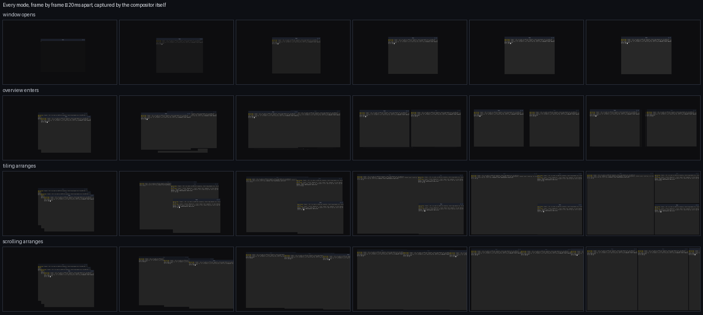
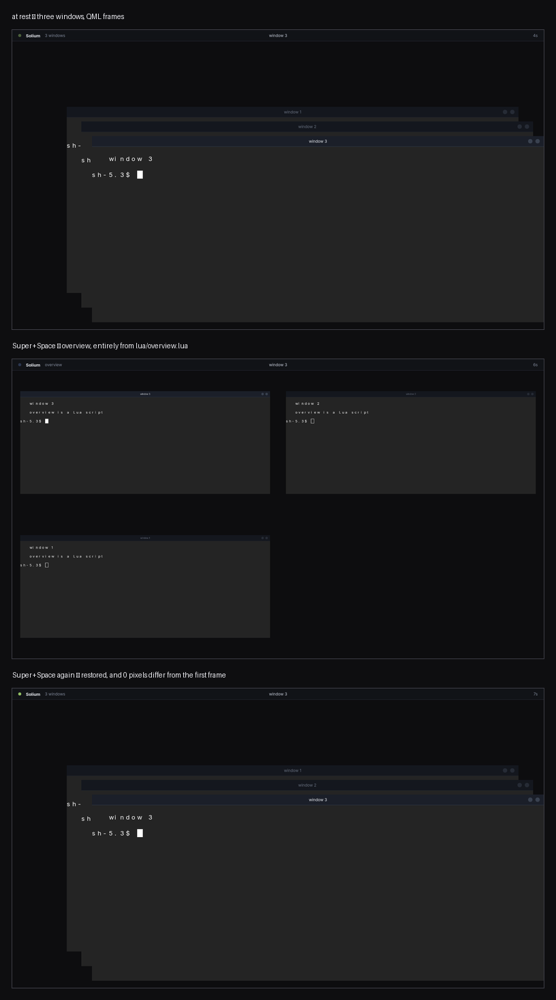

# Desktop modes

A mode is a Lua file. Tiling is one, scrolling is one, overview is one, and so
is whatever you write. The compositor holds no opinion about any of them.

That is not a boast about extensibility — it is the architecture's test. **If a
new mode needs new Rust, the transform layer is missing something**, and that
missing thing is the bug rather than your mode. Overview is ninety lines of Lua
for exactly this reason: it was written to find out whether the claim was true.



Every mode above is captured by the compositor reading back its own
framebuffer, twenty milliseconds apart. One engine drew all four rows, which is
the whole argument on one page: a window opening, overview entering, and two
layouts arranging are the same interpolation with different targets.

## The two ways to move a window

Everything a mode does comes down to one of these, and picking the wrong one is
the most common mistake.

```lua
sol.place(id, { x = 0, y = 0, w = 960, h = 1080 })   -- where it LIVES
sol.present(id, { rect = { x = 40, y = 40, w = 320, h = 180 } })  -- where it is DRAWN
```

`place` is the layout's authority. The window is really that size; the client is
told, and asked to redraw. Use it for arrangements — tiling, scrolling, a
window snapping back after a drag.

`present` is a transform. The window still lives where it lived and the client
never learns anything happened; it is simply drawn somewhere else. Use it for
anything temporary — overview, an app switcher, a peek, a genie. Then:

```lua
sol.present_clear(id)   -- animate back to real geometry and stop transforming
```

The distinction is why leaving overview is exact rather than approximate. The
layout was never disturbed, so there is nothing to restore.

`sol.present_from(id, rect)` is the third: draw the window at `rect` and animate
it to where it lives. That is every "appears from somewhere" animation — a
window opening, or growing out of a dock icon.

## What a mode is told

```lua
sol.on("open",   function(id) end)                 -- a window's life began
sol.on("close",  function(id) end)                 -- it is going
sol.on("focus",  function(id) end)                 -- the keyboard moved
sol.on("drop",   function(id, x, y) end)           -- a drag finished
sol.on("resize", function(id, x, y, horizontal, vertical) end)
sol.on("scroll", function(dx, dy) end)             -- a modified wheel turn
sol.on("click",  function(x, y) end)               -- only while grabbing input
sol.on("layout", function() end)                   -- the room windows get changed
```

Three of these are worth reading twice.

**`open` fires when the window opens, which is before its application exists.**
A window's life begins when the user asks for the program. Your mode is told
then, gets to place the window then, and the application appears inside it
later. Nothing special is required of you for that to work — but it is why
`open` is the event that puts a window into your arrangement, and `layout` is
not. A layout keeps its own structure and adds to it on `open`; `layout` only
means "re-run what you already hold".

**`resize` gives you the pointer's position, not a delta.** Deliberately: a
delta would be measured against a layout your own last response just changed,
and the windows shake for as long as the button is held. `horizontal` and
`vertical` say which axes the dragged edge can move.

**`click` only arrives while you hold input.** `sol.grab_input(true)` takes keys
and clicks away from clients, which is what a mode needs while it owns the
screen. Release it when you leave, or nothing will ever reach a window again.

## What a mode can ask

```lua
sol.windows()          -- every window: id, rect, drawn, title, focused, monitor
sol.monitors()         -- every monitor: name, x, y, w, h, whole, scale,
                       --                 transform, focused, primary
sol.monitor()          -- the active monitor's work area
sol.monitor(id)        -- the work area of the monitor that window is on
sol.cursor()           -- { x, y }
sol.window_at(x, y, skip)  -- the id under a point, optionally skipping one
```

`sol.windows()` is a snapshot taken fresh for your handler, never a live view.
A window closing while you hold its id is ordinary: `place` and `present` on an
id that no longer exists do nothing rather than failing.

`rect` is where the window lives; `drawn` is where it is being drawn right now,
which in a mode is somewhere else. Read `drawn` when you care what the user is
looking at, `rect` when you care what the layout thinks.

`skip` on `window_at` exists because of one specific bug: a new window is
already mapped and under the pointer, so asking "what am I pointing at" without
skipping it names the window as its own split target.

## A layout runs per monitor

There is **one global coordinate space** and every monitor is a rectangle in
it. That is the whole mechanism: a window is on the second screen because its
`x` lands there. There is no per-screen coordinate system and nothing to
convert.

The consequence is the thing to get right. `sol.monitor()` answers *one*
screen, so a mode that lays every window out against it piles both monitors'
worth of windows onto whichever one the pointer happens to be on. A layout is
per monitor:

```lua
local monitors = require("monitors")

for _, each in ipairs(monitors.each()) do
    -- each.monitor is the rect; each.windows are the windows on it
end
```

`monitors.each()` always lists every monitor, including one with nothing on it
— a layout has to hear about an empty screen, because that is what tells it the
last window left.

Anything stateful is keyed by monitor as well as workspace. `tiling.lua` keeps
a dwindle tree per pair and `scrolling.lua` a strip, via `monitors.key`:

```lua
local function tree_for(workspace, monitor)
    local key = monitors.key(workspace, monitor)
    ...
end
```

Two reasons, and the second is the one that bites. The screens are different
sizes, so a split or a column width that reads well on one is wrong on the
other. And a window moved across has to *leave* one arrangement and join the
other: a window in two trees is a window given two slots, and it ends up in
whichever was laid out last. `adopt` is where that settles — missing from its
new screen's tree, still in its old one's, both halves fixed in one pass.

**One `sol.animate` for every screen.** Two monitors rearranging at once is one
movement; see [animation.md](animation.md) on why the feel is set per batch and
not per window.

### A window is drawn only on the monitors it lives on

Its **slot** decides that, not its transform. A transform can move a window
around its own monitors and off them; it cannot put it on somebody else's.

This is worth knowing before you write a mode that moves a window a long way,
because it is what makes such a mode work on more than one screen. Workspaces
are the example. A workspace switch does not move windows — it draws the ones
belonging to other workspaces a screen away, and with one monitor "a screen
away" is off the desktop, which is how they are hidden. With two side by side,
one screen away is *the other monitor*: switching the left screen's workspace
threw its windows onto the right screen, on top of what was already there.

The intent was always containment; one screen just made moving and hiding the
same thing. So the rule is enforced where it belongs, and the slide stays one
screen long — which is what makes it read as a slide. Offsetting by the whole
desk instead would hide them correctly and look wrong: the window would leave
the screen halfway through and the next arrive halfway through, with empty
screen in between.

The slot and not the drawn rect, so a window straddling the bezel — dragged
between screens, where the slot itself is on both — is still drawn on both.

### Workspaces

`config.workspaces.per_monitor` decides whether each screen has its own
workspace in view. On by default: `super+2` switches the monitor the pointer is
on and leaves the other showing what it was. Off, one switch moves every
screen.

Both are real desktops, and the difference is what you take a workspace to
*be* — a screenful, or a whole desk. `workspaces.lua` shares every line
between them: which workspace a monitor shows is looked up by monitor either
way, and with the setting off every monitor looks up the same entry.

If you keep per-workspace state of your own, key it by monitor as well.
`monitors.key(workspaces.on(name), name)` is the string `tiling.lua` and
`scrolling.lua` both use, and `tree_for` takes only the monitor — the workspace
that screen is showing is something `workspaces` knows, and threading it
through every call site is how one of them ends up asking for the wrong
screen's.

`monitors.active()` is the monitor the pointer is on — where a new window goes,
and what a binding pressed with no particular window in mind is about. It is
the pointer and not the focused window on purpose: look at the second screen,
click the empty desktop, press the key for a terminal, and a focus-based rule
would open it on the screen you just looked away from.

The `primary` flag is a different question and answers a different one: it is
where things belonging to *one* screen go — a dock, a bar, a layer surface that
named no output. It does not move, which is the whole point of it. See
[shell-boundary.md](shell-boundary.md).

`x`, `y`, `w`, `h` are the **work area** — the monitor less whatever bars have
reserved — and `whole` is the monitor itself, which is what a wallpaper or a
fullscreen window covers. Both are in the global space, so either can be handed
straight to `sol.place`. Copy the rect before adding keys to it; the one you
were given belongs to the snapshot.

## The arrangements that ship

You do not have to compute geometry yourself.

```lua
local slots = sol.layout.grid(windows, area)          -- overview's grid
local slots = sol.layout.master_stack(count, area)    -- one big, the rest beside
local slots = sol.layout.strip(columns, area)         -- a row, with an offset
```

These are pure: windows in, rectangles out. Two are not, and cannot be:

```lua
local tree = sol.layout.tree()        -- dwindle
local scroller = sol.layout.scroller()  -- niri's model
```

A dwindle tree is stateful because the arrangement is. Where a window lands
depends on which window was split and where the pointer was, and no function of
"how many windows are there" can recover that afterwards. Same for a scroller:
which column is active and where the view sits relative to it are not in the
window list.

They are held by the script that made one, not by the compositor:

```lua
tree:insert(id, target, x, y, options)
tree:remove(id)
tree:contains(id)
tree:windows()
tree:layout(options)      -- the slots, to hand to sol.place
tree:resize(id, share)
tree:drag_seam(id, "width", x, y, options)
```

`options` is a monitor's work area with `gap` and `split` added. Passing the
monitor in rather than the tree asking for it is what lets one tree per
workspace *per monitor* exist without any of them knowing about either. Copy
the rect before adding keys — the one from `sol.monitors()` belongs to the
snapshot.

## A whole mode



Above: three windows at rest with their QML frames, `super+space` into overview,
and `super+space` again. The last frame differs from the first by zero pixels,
which is the property that matters — a mode that cannot put the desktop back
exactly is a mode nobody will use twice. All of it is `lua/overview.lua`.


This is real and it works. Paste it into `~/.config/solium/mymode.lua` and
`require("mymode")` from your `init.lua`.

```lua
-- Two columns, newest window on the right, everything else stacked on the left.
local modes = require("modes")
local mine = { active = false }

local function arrange()
    if not mine.active then return end
    local windows = sol.windows()
    if #windows == 0 then return end

    local area = sol.monitor()
    local gap = 12
    local half = (area.w - gap * 3) / 2

    sol.animate({ duration = 220, easing = "outCubic" })

    -- The newest window takes the right half.
    local newest = windows[1]
    sol.place(newest.id, {
        x = area.x + gap * 2 + half, y = area.y + gap,
        w = half, h = area.h - gap * 2,
    })

    -- The rest share the left half, top to bottom.
    local rest = #windows - 1
    if rest > 0 then
        local each = (area.h - gap * (rest + 1)) / rest
        for index = 2, #windows do
            sol.place(windows[index].id, {
                x = area.x + gap, y = area.y + gap + (index - 2) * (each + gap),
                w = half, h = each,
            })
        end
    end
end

sol.on("open",   arrange)
sol.on("close",  arrange)
sol.on("layout", arrange)

function mine.started() arrange() end
function mine.toggle() modes.use("mine") end

modes.register("mine", mine)
sol.bind("super+y", mine.toggle)

return mine
```

Four things in there are the conventions rather than the content.

**Register with `modes`, do not keep your own on/off flag.** A layout is a
choice of one. Two layouts both placing every window means the second one to run
wins and the arrangement looks like whichever that happened to be — and
switching away from one leaves its windows where it put them. `modes.use(name)`
turns the others off, calls your `started`, and calls their `stopped`. Calling
it with the mode already current falls back to floating, so one key toggles.

**Guard on `active`.** Your handlers stay registered when your mode is off.

**`sol.animate` before the batch, not per window.** It applies to everything
queued after it, so every window in one arrangement moves over the same interval
on the same clock. Setting it per window is how an arrangement ends up looking
like several separate animations that happen to overlap.

**Newest window first.** `sol.windows()` is topmost-first, which is the order a
hit test wants and the order "the one I just opened" is at the front of.

## Modes that are not layouts

`overview.lua` is worth reading as the other shape a mode takes: it grabs input,
transforms every window onto a grid with `present`, and clears them on the way
out. It never calls `place`, so the layout underneath is untouched and leaving
is exact.

That file is also the architecture's proof, and its comment says so — the app
switcher is that with a row instead of a grid, peek is it with one window at the
cursor, and the icon-to-window genie is it with an icon rect as the starting
point. If any of those ever needs new Rust, the transform layer is missing
something.

## Worth knowing

`solium --check` prints every binding it registered and will tell you an edit
dropped one. `super+shift+r` reloads while the session runs, so a mode can be
written against a desktop you are using.

A configuration that fails to load is reported with the file and the line, and
the running session keeps whatever it already had. A typo costs a line of output
rather than your windows.

See also: **[animation.md](animation.md)** for how the feel is configured,
**[ricing.md](ricing.md)** for the settings a mode should read rather than
hardcode.
