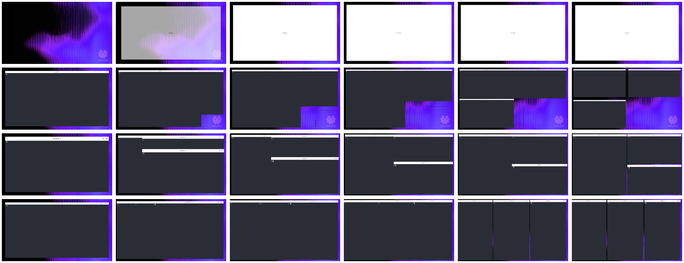
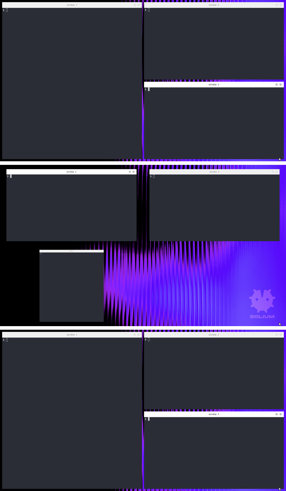

# Desktop modes

A mode is a Lua file. Tiling is one, scrolling is one, overview is one, and so
is whatever you write. The compositor holds no opinion about any of them.

That is not a boast about extensibility — it is the architecture's test. **If a
new mode needs new Rust, the transform layer is missing something**, and that
missing thing is the bug rather than your mode. Overview is about a hundred
lines of Lua for exactly this reason: it was written to find out whether the
claim was true.



Every mode above is captured by the compositor reading back its own
framebuffer, in a nested session with the shipped configuration. Each row starts
at the keypress and is every other frame of a burst taken twenty milliseconds
apart, so the pictures are about forty milliseconds apart and a row covers the
first fifth of a second. The first row is a window opening from `super+return`:
what opens is the loading window, which the terminal fills once it has started,
later than this row reaches. The other three start from three terminals on
top of one another and press `super+space`, `super+t` and `super+s`. One engine
drew all four rows, which is the whole argument on one page: a window opening,
overview entering, and two layouts arranging are the same interpolation with
different targets.

## The two ways to move a window

Everything a mode does comes down to one of these, and picking the wrong one is
the most common mistake.

```lua
sol.place(id, { x = 0, y = 0, w = 960, h = 1080 })   -- where it LIVES
sol.present(id, { x = 40, y = 40, w = 320, h = 180 })   -- where it is DRAWN
```

`place` is the layout's authority. The window is really that size; the client is
told, and asked to redraw. Use it for arrangements — tiling, scrolling, a
window snapping back after a drag.

**A placed rect is a tile, and the window is held inside it.** A client that
will not shrink as far as you asked — a terminal on its cell grid, a browser at
its minimum width — is cut to the rect rather than drawn over its neighbours,
and its frame and its hit test stop at the rect's edge too. A client smaller
than the rect keeps its own size. Two things let go of that:

```lua
sol.place(id, { x = 0, y = 0, w = 400, h = 300, tile = false })  -- placed, not tiled
sol.unplace(id)                                                   -- no longer tiled
```

`tile = false` is for a window you place without tiling it; `dialogs.lua`
centres a modal over its parent that way, because a dialog that grows after it
is centred must not be cut to the size it was centred at.

Two more things a placement can say, both for a window whose application has
an opinion about its size (#115):

```lua
sol.place(id, { x = 880, y = 420, w = 800, h = 600,            -- the window, smaller
                tile = { x = 12, y = 12, w = 2536, h = 1416 } }) -- than the tile it has
sol.place(id, { x = 12, y = 12, w = 1262, h = 1416, cramped = true })
```

`tile` as a rect is the tile a window sits inside when it is placed smaller
than it -- `tiling.lua` does this for a window centred at its own maximum size.
The window lives at the rect you place; the tile is what its client is held
inside, and what a drag on the window's edge moves the seam from, because a
seam is the tile's edge and not the window's. `cramped = true` says the tile is
smaller than the window's own minimum, and comes back in `sol.windows()`; see
[An application's own size](#an-applications-own-size). Each placement says it
afresh, so one that does not say it is not cramped, and neither is a window
placed with `tile = false` or let go with `sol.unplace`. `sol.unplace` is for
a layout letting go, and `modes.use` sends it for every window whenever the
layout in charge changes — so a mode registered through `modes` gets it for
free, and one that is not must send it itself. Maximising and fullscreen take a
window out of its tile on their own, and the way back puts it in again. A
script cannot see that a window is maximised or fullscreen, so a layout that
places every window on every pass (as `tiling.apply` does, and `dialogs.lua`
for every floated window) places those too. The window itself stays where it
is, over the arrangement. A tile placed is kept as the tile the window goes
back into; a placement with `tile = false` changes nothing, so a floated
window goes back to where it floated. The one placement that moves such a
window is a move by key onto another monitor: see
[Focus and move by direction](#focus-and-move-by-direction).

`present` is a transform. The window still lives where it lived and the client
never learns anything happened; it is simply drawn somewhere else. Use it for
anything temporary — overview, an app switcher, a peek, a genie. Then:

```lua
sol.present_clear(id)   -- animate back to real geometry and stop transforming
```

The distinction is why leaving overview is exact rather than approximate. The
layout was never disturbed, so there is nothing to restore.

`sol.present_from(id, rect)` is the third: draw the window at `rect` and animate
it to where it lives. That is every "appears from somewhere" animation — a
window opening, or growing out of a dock icon.

### Depth and pivot

```lua
sol.present(id, { z = 2 })                       -- drawn in front
sol.present(id, { rotate_y = 20, pivot_x = 0 })  -- turns about its left edge
```

`z` is draw order and nothing else. Equal values keep the order the stack gave
them, so the default costs nothing — and a window raised above its neighbour is
still **clicked where the layout put it**, because `rect` stays the truth for
input. It orders windows among themselves. With `fullscreen.covers = "top"`,
the default, the front window on the workspace in view is lifted into a band of
its own while it is fullscreen, above the `top` layer and above any window's
`z`.

`pivot` is a fraction of the window, not pixels: `(0.5, 0.5)` is the centre and
is the default, `(0, 0)` the top-left corner. **Each axis defaults on its own** —
`pivot_x = 0` means the left edge and says nothing about the vertical. Outside
`0..1` means what it says rather than being clamped: `pivot_x = 2` hinges the
window about a line off to its right, which is a door on a frame beside it.

A number that cannot be drawn with is dropped rather than drawn: a NaN depth
cannot be ordered against anything, a non-finite pivot puts every corner of the
window at NaN, and both fall back to the default with a line in the log. An
infinite `z` is kept — `math.huge` is a legible "above everything".

Both belong to a window, so both are `sol.present` keys. `sol.present_group`
takes neither, and that is deliberate: a pivot on a selection would have to
overrule each member's own — a member is drawn through one matrix, turning about
one point — and a depth would raise a desk's windows above the desk next door
while leaving its own wallpaper behind, because depth orders the windows and
scripted surfaces are drawn in fixed layers. Turning a whole desk as one shape
needs a rectangle for the selection, which no group has yet.

### Turning, fading and bending

The rest of what `sol.present` takes, all of it animated by the same clock and
all of it combinable with a rectangle, `z` and a pivot:

```lua
sol.present(id, { opacity = 0.5 })                     -- the compositor's alpha
sol.present(id, { rotate_y = 35, perspective = 900 })  -- tilted, in perspective
sol.present(id, { deform = {                           -- pulled into a rectangle
    effect = "genie", axis = "down", spread = 1.4,
    to = { x = 900, y = 1400, w = 120, h = 24 },       -- or { window = id },
} })                                                   -- or { surface = name }
```

`opacity` is the compositor's, not the client's: 0 draws nothing, and a window
at 1/255 or less takes no clicks. `rotate_x`, `rotate_y` and `rotate_z` are
degrees, applied in that order about the pivot, and `perspective` is the
viewer's distance in pixels, which is what makes a receding edge shrink rather
than merely narrow. None of them moves a click: the window is still clicked
across its flat rectangle.

`deform` bends the window with a vertex effect from `crates/effects`. There is
one, `"genie"`: `progress` from 0 (where the window is) to 1 (all of it inside
`to`, the default), `spread` for how much of the window moves at once (0 is
rigid, 1 by default), and `axis`, `"down"`, `"up"`, `"left"` or `"right"`, for
which edge leads. `to` is required. `{ window = id }` and `{ surface = name }`
are looked up again on every frame, so the effect follows its target as it
moves; a rectangle is fixed. A target that no longer exists draws the window
flat, and an effect name this build does not have is logged and ignored.
Animating to a deform starts from none, and `sol.present_clear` animates back
out of one.

`sol.present_group` takes `opacity` and the rotation keys too, applied on top of
each member's own, and a third argument, `{ duration = ..., easing = ... }`,
for a selection that moves at its own speed.

## Moving more than a window

A transform names a **selection**, and a selection can hold things that are not
windows at all:

```lua
sol.group("desk-2", {
    windows  = { 3, 7 },          -- by id
    surfaces = { "wallpaper-2" }, -- anything sol.surface declared
    monitors = { "DP-1" },        -- everything drawn on a screen
    monitor  = "DP-1",            -- which instance of each surface above
})
sol.present_group("desk-2", { x = -2560 }, { duration = 300 })
sol.present_group_clear("desk-2")
sol.group("desk-2", false)        -- take the name away
```

One call, one animation, one target. The wallpaper travels because it is *in*
the selection — the compositor has no idea what a wallpaper is, and does not
need one.

Three things to know before using it:

**`x` and `y` are a displacement, not a destination.** `sol.present` takes the
rectangle a window is drawn at; a selection has no rectangle of its own, so
`{ x = -2560 }` means "a screen to the left of wherever each member already is".

**It composes with each member's own transform.** A window you have also
`sol.present`ed is drawn at its own rect *plus* its selection's displacement, so
a window tilted inside a moving desk stays tilted within it. The corollary is
the one that catches people: a mode handing absolute rectangles to a window in a
carried selection is placing them **in that selection's space**. That is why
`overview.lua` shows the desk in front of you rather than every desk at once.

**Membership changes are animated.** A window that leaves one selection for
another would otherwise have the difference between the two displacements land
on it in a single frame; instead it is held where it was drawn and animates from
there, the same rule `sol.present` follows for a window entering a mode. The
duration is whatever `sol.animate` last set.

A selection naming a window that has closed, or a surface nothing declared,
simply does not contain it. There is nothing to clean up.

## What a mode is told

```lua
sol.on("open",   function(id) end)                 -- a window's life began
sol.on("surface", function(surface, action, data) end) -- a hosted scene sent an action
sol.on("closing", function(id) end)                -- a close was asked for
sol.on("refused", function(id) end)                -- ...and declined: it is back
sol.on("close",  function(id) end)                 -- it is gone
sol.on("focus",  function(id) end)                 -- the keyboard moved
sol.on("activate", function(id, why) end)          -- a window asked to come forward: "launch" or "request"
sol.on("drop",   function(id, x, y) end)           -- a drag finished
sol.on("resize", function(id, edge_x, edge_y, horizontal_side, vertical_side) end)
sol.on("scroll", function(dx, dy) end)             -- a modified wheel turn
sol.on("click",  function(x, y) end)               -- only while grabbing input
sol.on("layout", function() end)                   -- the room windows get changed
sol.on("monitors", function() end)                 -- the screens are not the screens you knew
sol.on("restore",  function() end)                 -- you have replaced a running session
sol.on("direction", function(verb, dir) end)       -- a direction key: "focus" or "move", and which way
sol.on("keyboard", function(state, changed) end)   -- the layout, Caps Lock or Num Lock changed: "layout", "caps" or "num"
sol.on("text_input", function(field, why) end)     -- the focused text field: "field", "caret" or "framed"
sol.on("fullscreen", function(id, entering) end)   -- it went fullscreen, or left: answer with sol.animate
sol.on("maximize", function(id, entering) end)     -- it was maximised, or restored: the same
```

Every handler, and every binding, has 100 ms, on a clock the compositor starts
for each one, so nothing a handler calls puts it off: past that it is stopped
with an error in the log, which names the file and line it was written at, so a
loop in one cannot freeze the desktop, even inside a coroutine it makes, around
a `pcall`, `xpcall` or `load`, which hand the stop on, or around
`sol.focus_direction`, and the other listeners still run. The `direction`
listeners' time counts against the handler that called `sol.focus_direction` or
`sol.move_direction`, so one stopped there stops that handler too. A `__gc`
finalizer, and the `__close` of a to-be-closed variable in the function a stop
interrupts, run where no hook does, so the deadline cannot stop a loop in
either: keep them short. A listener stopped three times stays off until
`super+shift+r`, and so does a `done` of `sol.act`, whose stops are counted the
same way
(`script::tests::a_listener_that_never_returns_is_stopped_and_the_others_still_run`,
`script::tests::a_binding_that_never_returns_is_stopped`,
`script::tests::a_handler_that_calls_sol_deadline_is_still_stopped`,
`script::tests::replacing_sol_deadline_leaves_each_listener_its_own_deadline`,
`script::tests::a_listener_that_never_returns_inside_a_coroutine_is_stopped`,
`script::tests::a_listener_that_retries_with_pcall_is_stopped`,
`script::tests::an_xpcall_handler_that_never_returns_is_not_called_for_the_stop`,
`script::tests::a_listener_that_retries_load_is_stopped`,
`script::tests::a_binding_that_loops_on_focus_direction_is_stopped`,
`script::tests::a_direction_listener_stopped_at_the_deadline_stops_its_caller_too`,
`script::tests::a_close_run_after_a_stop_is_not_under_the_deadline`,
`script::tests::a_gc_finalizer_is_not_under_the_deadline`,
`script::tests::a_stopped_listener_is_logged_with_its_file_and_line`,
`script::tests::a_listener_stopped_three_times_is_taken_out`,
`script::tests::a_done_stopped_three_times_is_not_called_again`).

`surface` is how a `sol.surface` declared with `interactive = true` talks
back: its scene calls `Solium.send(action, data)`, and you are told the
surface's name, the action and its data, a table, a value or `nil`, every
action in the order it was sent
(`script::tests::a_surface_action_reaches_lua_with_its_data`,
`state::tests::real_client::reflow_on_close::hosted::two_actions_from_one_frame_both_reach_lua_in_order`);
`sol.act(action, data, done)` performs the compositor's verbs, and
`lua/actions.lua` hands it the ones a scene sends
([shell-boundary.md](shell-boundary.md#what-a-hosted-shell-is-given) says
which; [ricing.md](ricing.md#your-wallpaper) has an example). Declaring the
same surface again with new `properties` writes them into the live scene rather
than rebuilding it. `keyboard` and `text_input` are for something that
reacts to typing rather than to windows:
[ricing.md](ricing.md#your-keyboard) says when each fires and with what, and
`lua/keyboard_indicator.lua` uses both. Eight of the rest are worth reading
twice.

**`open` fires when the window opens, and for a launched window that is before
its application exists.** A window started with `sol.spawn` begins its life
when the user asks for the program: your mode is told then, gets to place the
window then, and the application appears inside it later. That is
`loading.reserves_a_slot`, which is on by default. A window its application
opens by itself — a second browser window, a dialog — is told at its first
frame instead. Nothing special is required of you for either — but it is why
`open` is the event that puts a window into your arrangement, and `layout` is
not. A layout keeps its own structure and adds to it on `open`; `layout` only
means "re-run what you already hold".

**A close is three events, because a close is a request.** The compositor
cannot take a window away; it can only ask the application to go, and an
application with unsaved work puts up a dialog and stays. So:

| event | sent | means |
|---|---|---|
| `closing(id)` | the moment a close is asked for -- the frame's button, `sol.close`, `super+q` -- as the window starts fading | reflow now, if you want to |
| `refused(id)` | when the application declines -- it said nothing for a second, or answered with a dialog -- and the window is back on screen | put it back, if you took it out |
| `close(id)` | when the window is gone | forget it |

In that order. After `closing` exactly one of the other two follows, and
**`refused` never follows `close`**: once a window has gone, nothing brings it
back. A refused window is an ordinary window again, and closing it a second
time starts over with a second `closing`. A window whose application quit on
its own -- `exit`, its own Quit, a crash -- was never asked, so it gets `close`
and nothing before it; it still fades out where it stood, from what the
application last showed -- in front of the windows it was in front of and
behind the rest -- while a layout that reflows at `close` grows its
neighbours into the space, behind it. Its row is in `close`'s own snapshot, leaving, and
in no snapshot after.

`close` still means *gone*, and nothing else. Anything a script keeps about a
window -- `dialogs.forget`, `tiling.exiled` -- is dropped there and not at
`closing`, because a window that was only asked may be about to come back.
`refused` is not `open`: the window never went, and nothing about an arrival
should run again.

While a window is between `closing` and whichever comes next, its row in
`sol.windows()` says `leaving = true` (and so does its row in `close`'s own
snapshot). After `close` it is in no snapshot but that one. It is fading where
it stood whatever you do: the compositor pins the rectangle it is drawn at, so
placing it moves nothing you can see, and it stays in front of any window you
move into its space -- as does a refused window while it fades back in. It also
stays cut to the tile it was closed in, so a client wider than that tile does
not spill or squash as it fades: `sol.unplace`, or `tile = false`, on a window
that is leaving waits, and takes effect if a refused close brings it back.
`modes.use` counts on that, since it lets every window go.

The shipped layouts close up at `closing`, while they are the layout in
charge, and put the window back at `refused`; `reflow_on_close = "when_gone"`
in their section of `config.lua` makes both events do nothing and leaves the
reflow to `close`, which is how every close worked before #128. Closing up at
once has one cost worth knowing: the compositor waits a second for an
application to go before it takes the silence for a refusal, so one slower
than that to quit is refused and then closes, and the layout moves three times
-- at the press, at `refused`, and at `close`.

A layout that listens for neither event hears exactly what it always heard --
`close`, once the window is gone -- so a mode written before these two existed
keeps working unchanged, and keeps its slot for a closing window until the
application has gone. To close up at once, handle `closing`, leave `leaving`
windows out of any arrangement you build from `sol.windows()`, and put the
window back on `refused`.

**`focus` is heard for a new window too**, in every mode and for an X11
window as much as a Wayland one. The compositor gives a window the keyboard at
its first frame, once your `open` handler has placed it, and only if it is
headed somewhere the user can see; it does that as `sol.focus` would, so you
hear `focus` for it. If your `open` handler calls `sol.focus` itself, yours is
the last word and the compositor does not give it again. A window launched with
`sol.spawn` gets it the same way when its application arrives; a `sol.focus`
for it during `open` finds no application yet to give it to.

**`activate` says a window asked to be brought forward**, with an activation
token such as a notification you clicked hands it, and it comes after the
compositor has answered. That answer is the same whatever the token: a window
on a workspace nobody is looking at, or one being closed, is refused outright
-- it is not focused, you hear no `focus`, and the keyboard stays where it was.
Anywhere else it is focused first and asked afterwards: you hear `focus`, and
if your handler brings the window into view (the scroller scrolls its column
onto the screen) it keeps the keyboard. If it is still somewhere nobody can see
once the layouts have had their say, the keyboard goes back to a window on
screen. Then you hear `activate(id, why)`, and `why` says who asked:

| `why` | sent when | the shipped scripts |
|---|---|---|
| `"launch"` | you launched an application that was already running, and it answered by bringing forward a window it had | show the window's workspace on its own monitor, and focus it |
| `"request"` | anything else | do nothing more |

`"launch"` is Firefox, Telegram, any GTK or Qt application that keeps one
instance: `sol.spawn` opens a window for the launch, the program passes the
launch on to the instance running, and that instance brings forward the window
it already has, with the launch's own token. That window is not the launch
arriving. The window opened for the launch dissolves, as one whose application
never came does, and you hear its `close`; the window brought forward keeps its
id, its workspace and its tile -- a tile the launch's window split closes up
again as that window goes -- and you hear no `open` or `close` for it. So
the view going to it is yours to do, and `workspaces.lua` does it, as a dock
does for an application that is running -- without that, a launch whose window
is on another workspace shows nothing at all. A window the application opens
*for* the launch, one per activation or from a launcher that forks, is the
launch arriving as before: it appears in the window that was opened for it, and
there is no `activate`.

`"request"` is followed by nothing in the shipped scripts because nothing checks
where a token came from: any client can make one for itself, and a view that
followed every request would be one any application could pull away from you.

**`resize` gives you where the dragged edge should go, not where the pointer
is and not a delta.** `edge_x` and `edge_y` are in the same coordinates
`tree:layout` returns and `sol.place` takes — one per axis, so a corner drag's
two seams each get their own.

A position rather than a delta, deliberately: a delta would be measured against
a layout your own last response just changed, and the windows shake for as long
as the button is held. But a position *of the edge* rather than of the pointer,
also deliberately, and that is #124. A seam set from the cursor lands under the
cursor, so a drag begun anywhere except exactly on the edge threw that edge
across to the cursor on its first frame — half a border's width for a border
drag, and most of a window for `super`+right-button, which starts a resize from
wherever inside the window you happened to press. Handed the edge instead, the
same arithmetic makes the gesture relative: the edge starts where it already is
and moves as far as the pointer moves.

"Where it already is" means *where you put it* — the rect your last
`sol.place` for that window carried — and not where the client drew itself. The
two differ whenever a client commits a size other than the one it was asked
for, which a terminal on a cell grid does every time. Hand that back on a first
frame and your seam moves by the client's rounding before the pointer has
travelled a pixel, so the compositor sends your own number back to you.

On an axis this drag does not move there is no dragged edge, and the pointer's
own coordinate comes through there instead. Check the side before using the
coordinate — which is what the side is for — and you will never see it.

**`horizontal_side` and `vertical_side` are the *sides* being dragged**, not the axes:
`"left"` or `"right"`, `"top"` or `"bottom"`, and `nil` for an axis this drag
does not move. A corner drag fills both, because a corner drag moves one seam
per axis. They were booleans until #120, and a boolean cannot choose a seam: a
window sitting on the right of a vertical split has that split's seam on its
*left*, so "the horizontal axis is in play" was true whichever edge the hand
was on, and dragging the right edge moved the left one instead. Hand the side
straight to `tree:drag_seam`.

**`click` only arrives while you hold input.** `sol.grab_input(true)` takes keys
and clicks away from clients, which is what a mode needs while it owns the
screen. Release it when you leave, or nothing will ever reach a window again.

**`restore` fires after a reload and never at startup.** That asymmetry is the
event. See below.

## What survives `super+shift+r`

A reload throws the whole Lua state away and reads your files again. The
session does not go with it: the windows, the monitors, the workspace in view
and the layout in charge are all still exactly what they were. So your mode
comes back as a stranger to a desktop it was running a moment ago, and it is
entitled to exactly two things.

**Whatever you handed to `sol.keep`.**

```lua
local state = sol.keep("my-mode", { showing = 1 })
```

You get the table the last load left under that name, or the defaults the first
time. Mutate it in place; the host takes a copy when the reload happens. It
holds plain data — numbers, strings, booleans and tables of those — and the
trees and strips `sol.layout.tree()` and `sol.layout.scroller()` make, which
come back whole. A function in there cannot cross and is named in the log
rather than dropped in silence.

Keep as little as you can. Anything you can work out again from `sol.windows()`
and `sol.monitors()` should be worked out again, because a keep is a claim about
the past that nothing checks.

An arrangement is the exception, because it cannot be worked out again: the
window list says which windows there are, not where the user put them. The
shipped layouts keep theirs. Before they did, a reload rebuilt each one from the
window list, topmost first, and windows traded places (#118). A strip that
comes back still has the widths the last file gave it, so `scrolling.lua` hands
it the new ones with `view:configure(config.scrolling)`.

**And the world, re-announced:** `restore`, then `monitors`, then `layout`.

`restore` is the moment every script has loaded, which is the earliest you can
touch another module's registrations — `lua/modes.lua` uses it to make the
remembered layout active again, which it cannot do at its own top level because
`lua/tiling.lua` has not registered itself yet. `monitors` then says the screens
are what they are, and `layout` asks you to arrange.

Without this, a reload was a quiet way to lose the session: on workspace 3 it
came back believing it was on workspace 1, put every window on desk 1, and drew
the desk two screen-widths off-stage with no key that brought it back. That is
issue #116, and both halves above are what it cost.

## What a mode can ask

```lua
sol.windows()          -- every window: id, x, y, w, h, title, focused, monitor,
                       --                modal, parent, leaving, app_id, min, max,
                       --                cramped, shown
sol.monitors()         -- every monitor: name, x, y, w, h, whole, scale,
                       --                 transform, focused, primary, power
                       --   (x, y, w, h: the work area, less layer-shell
                       --   bars and hosted reserves)
sol.monitor()          -- the active monitor's work area
sol.monitor(id)        -- the work area of the monitor that window is on
sol.cursor()           -- { x, y }
sol.window_at(x, y, skip)  -- the id under a point, optionally skipping one
```

`sol.windows()` is a snapshot taken fresh for your handler, never a live view.
A window closing while you hold its id is ordinary: `place` and `present` on an
id that no longer exists do nothing rather than failing.

`x`, `y`, `w` and `h` are where the window *lives*, which is what the layout
thinks. No field says where it is being *drawn*: a mode that presented it
somewhere else knows, because it said so. To ask what the user is looking at,
ask `sol.window_at`, which answers by what is on screen — the rectangle each
window is drawn at, whether it is visible at all, and whether the monitor under
the point is showing it.

`power` is `"on"` or `"off"`. A monitor turned off, by `sol.monitor_power` or
by `idle.screens_off_after`, keeps its place, its work area and its windows,
and no `monitors` or `layout` event fires for it: keep arranging it as if it
were lit, because input turns it back on exactly as it was.

`modal` is a window that says it is a modal dialog — a save prompt, a
permissions box — and `parent` is the window it belongs to. A layout should
leave a modal out of its arrangement and put it over its parent; `dialogs.lua`
is that policy, shared by `tiling.lua` and `scrolling.lua` so the two cannot
disagree. Onto its *parent's* monitor, which is not always its own: a window is
mapped at the origin and belongs to whichever screen that lands on, so a dialog
for a window on the second screen arrives on the first one and has to be moved
off it. `dialogs.place` is where that is decided, from the rect it is centred on
rather than from the screen it was mapped on.

Dragging one is allowed and sticks: `dialogs.dropped` records where it was
dropped as an offset from its parent, so the prompt you pushed off the sentence
it was covering stays off it, and still follows the document when the layout
moves it. Staying *above* that document is not the layout's business at all —
the compositor keeps a modal over its parent in the stack, whatever raises what
(`Solium::map_stacked`).

`parent` has three values and it is worth knowing why. It is the parent's id
when there is a window to point at, `false` when the client named a parent that
is not on screen — not mapped yet, not ours, or closed while its dialog was
still up — and absent when no parent was ever named. So `if window.parent then`
is the right question for "have I got something to centre on", and
`window.parent == false` is how you tell a lost parent from no parent at all.

`min` and `max` are how small and how large the window's own application says
it can be, `{ w = ..., h = ... }` -- in the same terms as `w` and `h`, frame
included, so they compare with a tile directly -- and absent when it limited
neither side. 0 on one side is no limit on that side. They are what the client
has *committed*, never a size it has asked for and not yet drawn to, and a
change to either re-runs `layout` once per change. `cramped` is the layout's own
word coming back: `true` while the layout in charge last placed the window with
`cramped = true`. `app_id` is the application's name for itself -- a Wayland
application's `app_id`, an X11 one's `WM_CLASS` class -- and empty until the
application has arrived. `shown` is whether the application has been shown
yet: `false` for a window launched with `sol.spawn` from its `open` until its
application's first frame, which is how a layout tells limits that arrive in
time to decide where a window goes from limits that changed on a window
already on screen.

`skip` on `window_at` exists because of one specific bug: a new window is
already mapped and under the pointer, so asking "what am I pointing at" without
skipping it names the window as its own split target.

## A layout runs per monitor

There is **one global coordinate space** and every monitor is a rectangle in
it. That is the whole mechanism: a window is on the second screen because its
`x` lands there. There is no per-screen coordinate system and nothing to
convert.

The consequence is the thing to get right. `sol.monitor()` answers *one*
screen, so a mode that lays every window out against it piles both monitors'
worth of windows onto whichever one the pointer happens to be on. A layout is
per monitor:

```lua
local monitors = require("monitors")

for _, each in ipairs(monitors.each()) do
    -- each.monitor is the rect; each.windows are the windows on it
end
```

`monitors.each()` always lists every monitor, including one with nothing on it
— a layout has to hear about an empty screen, because that is what tells it the
last window left.

Anything stateful is keyed by monitor as well as workspace. `tiling.lua` keeps
a dwindle tree per pair and `scrolling.lua` a strip, via `monitors.key`:

```lua
local function tree_for(monitor)
    local key = monitors.key(workspaces.on(monitor), monitor)
    ...
end
```

Two reasons, and the second is the one that bites. The screens are different
sizes, so a split or a column width that reads well on one is wrong on the
other. And a window moved across has to *leave* one arrangement and join the
other: a window in two trees is a window given two slots, and it ends up in
whichever was laid out last. `adopt` is where that settles — missing from its
new screen's tree, still in its old one's, both halves fixed in one pass.

**One `sol.animate` for every screen.** Two monitors rearranging at once is one
movement; see [animation.md](animation.md) on why the feel is set per batch and
not per window.

### A window is drawn only on the monitors it lives on

Its **slot** decides that, not its transform. A transform can move a window
around its own monitors and off them; it cannot put it on somebody else's.

This is worth knowing before you write a mode that moves a window a long way,
because it is what makes such a mode work on more than one screen. Workspaces
are the example. A workspace switch does not move windows — it draws the ones
belonging to other workspaces a screen away, and with one monitor "a screen
away" is off the desktop, which is how they are hidden. With two side by side,
one screen away is *the other monitor*: switching the left screen's workspace
threw its windows onto the right screen, on top of what was already there.

The intent was always containment; one screen just made moving and hiding the
same thing. So the rule is enforced where it belongs, and the slide stays one
screen long — which is what makes it read as a slide. Offsetting by the whole
desk instead would hide them correctly and look wrong: the window would leave
the screen halfway through and the next arrive halfway through, with empty
screen in between.

The slot and not the drawn rect, so a window straddling the bezel — dragged
between screens, where the slot itself is on both — is still drawn on both.

### Workspaces

`config.workspaces.per_monitor` decides whether each screen has its own
workspace in view. On by default: `super+2` switches the monitor the pointer is
on and leaves the other showing what it was. Off, one switch moves every
screen.

Both are real desktops, and the difference is what you take a workspace to
*be* — a screenful, or a whole desk. `workspaces.lua` shares every line
between them: which workspace a monitor shows is looked up by monitor either
way, and with the setting off every monitor looks up the same entry.

Launching an application that is already running goes to its window where it
is: `workspaces.lua` shows that window's workspace on the window's own monitor
-- so with `per_monitor` on, the screen in front of you goes on showing what it
was if the window is on the other -- and focuses it. That is its `activate`
handler; see [What a mode is told](#what-a-mode-is-told).

A workspace is a **selection**, one per monitor per workspace, named
`desk-<n>@<connector>`. `workspaces.lua` declares it from the windows on that
desk plus that desk's background, and carries it with a single
`sol.present_group` — which is why a per-workspace wallpaper travels with the
switch. Set `config.wallpaper` to a list of images to get one; a single image
belongs to the monitor and stays put, because every desk sharing one picture
makes a wallpaper that slides indistinguishable from one that does not.

If you keep per-workspace state of your own, key it by monitor as well.
`monitors.key(workspaces.on(name), name)` is the string `tiling.lua` and
`scrolling.lua` both use, and `tree_for` takes only the monitor — the workspace
that screen is showing is something `workspaces` knows, and threading it
through every call site is how one of them ends up asking for the wrong
screen's.

`monitors.active()` is the monitor the pointer is on — where a new window goes,
and what a binding pressed with no particular window in mind is about. It is
the pointer and not the focused window on purpose: look at the second screen,
click the empty desktop, press the key for a terminal, and a focus-based rule
would open it on the screen you just looked away from.

The `primary` flag is a different question and answers a different one: it is
where things belonging to *one* screen go — a layer surface that named no
output, or a hosted shell or `sol.surface` declared with `on = "primary"`. The
hosted shell is on every monitor unless `shell.on` names one. It does not
move, which is the whole point of it. See
[shell-boundary.md](shell-boundary.md).

`x`, `y`, `w`, `h` are the **work area** — the monitor less whatever bars have
reserved, layer-shell clients and hosted surfaces alike — and `whole` is the
monitor itself, which is what a wallpaper or a
fullscreen window covers. Both are in the global space, so either can be handed
straight to `sol.place`. Copy the rect before adding keys to it; the one you
were given belongs to the snapshot.

## Focus and move by direction

```lua
sol.focus_direction("left")   -- or "right", "up", "down"
sol.move_direction("left")
sol.toggle_fullscreen(id)     -- fullscreen, or back; the focused window with no id
sol.toggle_maximize(id)       -- maximised, or back; the focused window with no id
```

The compositor does nothing with these but tell every `direction` listener
the verb and the direction, and a direction that is not one of the four is an
error. `lua/direction.lua` is the listener that ships, and it asks the layout in
charge, by two functions on the table you gave `modes.register`:

```lua
function mine.focus_direction(dir) ... return true end
function mine.move_direction(dir) ... return true end
```

Answer `false`, or leave either out, and the key gets what a desktop with no
layout in charge gets: focus goes to the nearest window that way, and a move
trades places with it, each window keeping its size. `tiling.lua` answers
`false` for focus from a window it does not tile -- a dialog, or one floated
with `super+shift+space` -- so the keyboard still finds its way out of one.

Which window is that way depends on what kind of windows they are. A tile's
neighbour is wholly past its edge and level with some of it -- a tile below and
to one side is not to its side -- and the nearest facing edge wins. Floating
windows overlap and sit off on diagonals, so for them, failing any such
neighbour, the nearest centre further that way counts too.

At a monitor's edge both go on to the next monitor that way, and the desk it is
showing. The next monitor is one wholly past this one's edge, as wlroots has it:
a portrait screen standing beside a landscape one is beside it and never below,
and a smaller screen top-aligned next to a bigger one is above nothing. Of two
that way, the one level with the window wins, so with two screens stacked
beside a big one the window's own height picks between them. On the next
monitor the nearest centre counts for tiles as well, since a screen of another
height may have nothing level with the window.

`direction.find(from, dir, on, loose)` is that search, for a layout's own
rectangles: `on(name)` lists them for a monitor, `loose` is the floating rule,
and you get back the nearest, its monitor, and whether that meant crossing to
another one.

| | focus | move |
|---|---|---|
| tiling | the tile that way | trades tiles with it; `tiling.move = "split"` splits its tile across that tile's longer side instead |
| scrolling | the next column, or the window above or below in one | the column, or the window within its column |
| no layout | the nearest window that way | trades places with it |

Across a monitor a move takes the window alone: into the tile it arrives beside
in tiling, into a column of its own in scrolling, and as far across the new
screen as it was across the old one with no layout. The shipped keys, all of
them replaceable in `config.bindings`:

| keys | |
|---|---|
| `super+arrows`, `super+h` `j` `k` `l` | focus that way |
| `super+shift+arrows`, `super+shift+h` `j` `l`, `super+alt+k` | move that way |
| `super+f` | fullscreen, and back |
| `super+shift+m` | maximised, and back |
| `super+shift+space` | float over the layout, and back into it |

Moving up on `k` is `super+alt+k` because `super+shift+k` cycles the keyboard
layout. A window floated with `super+shift+space` is, to both layouts, what a
dialog with no parent is: out of the arrangement, centred on its screen at the
size it had, until the key puts it back. It stays floated through a reload.

`super+shift+m` on a fullscreen window leaves fullscreen for maximised, or,
for one that was maximised before it went fullscreen, for where it was before
either. `super+f` and `super+shift+m` act on Wayland windows only for now: an
X11 window under XWayland does not go fullscreen or maximised by key.

A fullscreen or maximised window stays so when it is moved. On its own monitor
the move happens behind it: in tiling it trades tiles with the one that way,
and leaving fullscreen or maximised goes into the tile it has now. Onto another
monitor it is fullscreen or maximised there, drawn on the workspace that
monitor shows and keeping the keyboard, and leaving stays on that monitor: in
its tile there, or with no layout at the same place on the new screen as it
had on the old one. A window floated with `super+shift+space` and then made
fullscreen stays fullscreen through every layout pass, and leaving goes back to
where it floated.

### Going fullscreen or maximised, and back

The compositor makes the change and the scripts choose how it looks. On the
key, or when an application asks, the window is told its new size at once and
lives at its new rectangle -- the whole monitor it is on, its work area, or
the place or tile it came from. Then `fullscreen` or `maximize` is told,
`(id, entering)`, and once every listener has run the window's picture glides
there from wherever it is drawn, through the same transform a layout's glide
uses, with the timing a listener set with `sol.animate`. With none set, the
change is instant:

```lua
sol.on("fullscreen", function(id, entering)
    sol.animate({ duration = 260, easing = "outCubic" })
end)
```

`lua/fullscreen.lua` is the listener that ships, reading `fullscreen` and
`maximize` in `config.lua` -- `animate`, or `false`, and `instant.app_id`, each
section on its own ([ricing.md](ricing.md#your-own-animation-feel)). The rest is
the compositor's, whatever the listener says:

- **From what is on screen.** Pressing the key again half way turns the window
  round where it is drawn, not where it was headed or where it came from
  (`state::tests::real_client::fullscreen_glides::a_second_toggle_mid_flight_starts_from_where_the_window_is_drawn`).
- **Answered at once.** The application is configured on the key, not when the
  glide lands
  (`state::tests::real_client::fullscreen_glides::the_client_is_told_its_new_size_on_the_toggle`),
  and the window is held at its new rectangle until the application draws at
  that size, as a window whose edge you drag is: its last picture is stretched
  into the rectangle the glide has reached, and after the glide lands, into the
  rectangle it landed on
  (`state::tests::real_client::fullscreen_glides::a_slow_client_is_drawn_stretched_until_it_answers`).
  An application that says nothing is held a quarter of a second past the
  landing, and then shown at the size it has
  (`state::tests::real_client::fullscreen_glides::a_client_that_never_answers_is_drawn_as_it_is_once_its_patience_runs_out`);
  an edge drag on it takes it over
  (`state::tests::real_client::fullscreen_glides::an_edge_drag_takes_a_window_its_change_is_holding`).
- **Plain at rest.** The transform is released when the glide lands, so a
  fullscreen game or video is drawn with nothing in between
  (`state::tests::real_client::fullscreen_glides::a_window_glides_into_fullscreen_and_out_again`).
  A monitor unplugged, a reload or a lock part of the way through changes that
  for nobody: the window comes to rest all the same
  (`state::tests::real_client::fullscreen_glides::a_monitor_unplugged_mid_glide_leaves_the_window_at_rest`,
  `state::tests::real_client::fullscreen_glides::a_reload_mid_glide_leaves_the_window_at_rest`,
  `state::tests::real_client::lock_focus::a_lock_mid_glide_leaves_the_window_at_rest`).
- **Instant is nothing at all.** A change with no motion -- `animate = false`,
  an application on the `instant` list, no listener -- puts no transform on
  the window and holds nothing: the next frame draws it as it is, as before
  the glide existed, and stops one in flight
  (`state::tests::real_client::fullscreen_glides::an_instant_change_draws_the_window_as_it_is_on_the_next_frame`,
  `state::tests::real_client::fullscreen_glides::an_instant_change_part_of_the_way_through_a_glide_holds_nothing`).
- **Turned round, it keeps its way back.** Pressed again before the application
  has drawn at the size it went back to, the rectangle kept for the next way
  out is the one it was told, not the monitor's it has not left yet
  (`state::tests::real_client::fullscreen_glides::turning_round_part_of_the_way_out_keeps_the_way_back`).
- **On its own monitor.** A window grows to cover the monitor it is on, and
  shrinks back on it
  (`state::tests::real_client::fullscreen_glides::a_window_on_the_second_monitor_glides_to_cover_that_one`).
- **Over the bars while it is big.** A window going fullscreen goes over the
  bars as it starts to grow, and one leaving goes back under them once it has
  finished shrinking; a press goes to what is drawn there
  (`state::tests::real_client::reflow_on_close::stacking::a_window_is_lifted_as_it_starts_to_grow_and_dropped_once_it_has_shrunk`).
- **Into its tile with its own motion.** A window going back into a tile is
  placed by the layout, and the change's glide replaces the layout's
  (`tests/scenarios/fullscreen-tiled.lua`). It shrinks in front of its
  neighbours, whichever the layout placed last, and a sweep part of the way
  through leaves it there
  (`state::tests::real_client::a_tiled_window_leaving_fullscreen_stays_in_front_while_it_shrinks`).
- **Not told twice.** A listener that toggles the window back has that done at
  once and is not told it
  (`state::tests::real_client::fullscreen_glides::a_listener_that_toggles_the_change_back_is_not_told_it_again`).

The compositor's move comes after the listeners' commands, so a `sol.present`
of the window in one is replaced by it. A window a mode was already presenting
before the change -- a thumbnail in the overview -- is left where the mode
draws it: the change is made, and the mode's `sol.present_clear` brings the
window to its new rectangle
(`state::tests::real_client::fullscreen_glides::a_window_a_mode_presents_stays_where_the_mode_draws_it`).

## The arrangements that ship

You do not have to compute geometry yourself.

```lua
local slots = sol.layout.grid(windows, area)          -- overview's grid
local slots = sol.layout.master_stack(count, area)    -- one big, the rest beside
local slots = sol.layout.strip(columns, area)         -- a row, with an offset
```

These are pure: windows in, rectangles out. Two are not, and cannot be:

```lua
local tree = sol.layout.tree()        -- dwindle
local scroller = sol.layout.scroller(config.scrolling)  -- niri's model
```

A dwindle tree is stateful because the arrangement is. Where a window lands
depends on which window was split and where the pointer was, and no function of
"how many windows are there" can recover that afterwards. Same for a scroller:
which column is active and where the view sits relative to it are not in the
window list.

They are held by the script that made one, not by the compositor:

```lua
tree:insert(id, target, x, y, options)
tree:insert_fitting(id, target, x, y, options)  -- the same, if it keeps options.minimum
tree:insert_largest(id, options)                -- the largest tile with room
tree:remove(id)
tree:contains(id)
tree:windows()
tree:layout(options)      -- the slots, to hand to sol.place; cramped = true on a
                          -- slot smaller than its window's own floor
tree:resize(id, "width", share, options)               -- keyboard: an axis
tree:drag_seam(id, "right", edge_x, edge_y, options)   -- pointer: a side
tree:swap(a, b)           -- two windows trade tiles; every split keeps its ratio
```

`insert` splits whatever it is pointed at, however small that leaves the
halves. `insert_fitting` and `insert_largest` refuse a split that would leave a
tile under `options.minimum` -- `{ w = ..., h = ... }`, frame included -- and
answer `false` with the tree untouched, so a layout can try one, then the
other, then fall back to `insert`. That is what `tiling.lua` does; see below.

The two resize calls take different things on purpose. A drag names a side —
the hand is on one specific edge, and which seam moves follows from that. A
keypress names only an axis: `super+equal` means "wider" and says nothing about
which neighbour gives up the room, so `resize` prefers the seam on the right or
below and falls back to the other, with positive `share` always growing the
window. Either way, a window flush against its container on that side has no
seam there and nothing happens — the screen edge is not a seam.

`drag_seam` puts the named side of that window at `edge_x` (for `"left"` and
`"right"`) or `edge_y` (for `"top"` and `"bottom"`), reading only the one its
side names — which is what lets a corner drag call it twice with one pair and
have each axis take its own. Hand it the `edge_x`, `edge_y` a `resize` gave you
and the gesture is relative; hand it the pointer and you have rebuilt #124.
The ratio it computes is separately clamped to `0.05..0.95`, so a window shoved
hard against a seam stops there rather than vanishing, and to whatever keeps
every tile on either side of the seam at `options.minimum`. Those clamps are
the only bounds on a tiled drag: the compositor sends an unfloored edge,
deliberately, because a floor measured in a window's pixels cannot bound a
seam's position — see `Tiling::drag_seam`. A tile already under the minimum
is not snapped up to it when grabbed, which would move it on the first frame:
it cannot be shrunk further, and can be grown only while the tiles across the
seam have room to give. A seam with a tile under the minimum on both sides
therefore does not move at all, and that is what `"allow"` below usually
leaves, since it halves a tile too small to split. `resize` is bounded the
same way when it is given `options`; without them, as a script written before
#134 calls it, only `0.05..0.95` applies.

`options.floors` is each window's own floor, `{ [id] = { w = ..., h = ... } }`,
frame included: the smallest its application says it can be, or nothing for a
window with no entry. Every call that takes `options` reads it. The tree lays
each split out at the ratio it holds, then moves it just far enough for a
window under its floor to reach it, taking the room from the other side down to
*its* floors and `options.minimum`, and no further; the ratio it holds is left
alone, so a window whose floor goes away hands the room back. `insert_fitting`
and `insert_largest` refuse a split that would leave either window under its
floor, and a seam stops at the floors beside it. A window the room is not there
for is laid out short, and its slot says `cramped = true`. The scroller reads
`options.floors` too, and never lays a column out narrower than the widest
floor in it.

`options` is a monitor's work area with `gap`, `split`, `minimum` and `floors`
added — and, for the other arrangements, `ratio` (the master window's share,
for `master_stack`), `column` (a column's share, for `sol.layout.scrolling`)
and `padding` (around each thumbnail, for `grid`).
Passing the monitor in rather than the tree asking for it is what lets one tree
per workspace *per monitor* exist without any of them knowing about either.
Copy the rect before adding keys — the one from `sol.monitors()` belongs to the
snapshot.

A scroller holds columns, and each column holds windows stacked top to bottom:

```lua
scroller:insert(id, options)              -- a new column, right of the active one
scroller:insert_into_column(id, options)  -- into the active column instead
scroller:remove(id)
scroller:focus_window(id, options)        -- focus it, and bring its column into view
scroller:focus_sideways(by, options)      -- by columns: -1 left, 1 right
scroller:focus_vertically(by)             -- within the active column
scroller:move_column(by, options)         -- swap the active column with a neighbour
scroller:consume()                        -- pull the next column's focused window in
scroller:expel(options)                   -- push the focused window out into a column
scroller:move_to_column_of(id, target, options)  -- what a drop means here
scroller:widen(id, by, options)           -- by a share of the view, clamped
scroller:cycle_width(options)             -- through config.scrolling.widths
scroller:configure(config.scrolling)      -- new widths, same columns and view
scroller:scroll_by(dx)                    -- move the view, not the focus
scroller:focused()
scroller:contains(id)
scroller:windows()                        -- left to right, then top to bottom
scroller:layout(options)                  -- the slots, to hand to sol.place
```

Every column shares one width, so `widen` on any window in a column widens the
column. Calls that move the focus to a column also bring it into view, which is
what keeps a focused column from hanging off the edge of the screen.
`configure` is for a strip `sol.keep` carried across a reload, which is not
made again and would otherwise go on with the widths of the file it was made
from.

Three more pure helpers sit beside `strip`: `sol.layout.scrolling(count,
options)` lays out `count` columns, each `options.column` of the width, and
`sol.layout.scroll_to` and `sol.layout.strip_scroll_to` answer how far to
scroll to bring a column into view.

### When a new window has no room

`tiling.lua` gives a new window the tile under the pointer, split across its
longer side. When that would leave a tile under `config.tiling.minimum` it tries
the tile's other side — a wide, short tile with no room side by side may still
have room one above the other — and when neither has room it works through
`config.tiling.overflow`, in order, until a step places the window:

| step | what it does | when it does nothing |
|---|---|---|
| `"largest"` | splits the largest tile on this workspace that has room | no tile has room either way |
| `"workspace"` | opens the window on the next empty workspace of the monitor it opened on, after the one in view and round again | every workspace has a window on it |
| `"allow"` | splits the tile under the pointer anyway, below the minimum | never |

The default is `{ "largest", "workspace", "allow" }`. A list that runs out
ends in `"allow"` regardless, with a line in the log, because a window has to
go somewhere.

"Empty" does not count a window that is being closed, unless
`reflow_on_close = "when_gone"` is keeping its tile. With
`workspaces.per_monitor` off it means empty on every screen, since that
workspace is every screen at once. A window that belongs to no workspace in
particular is on every one — the view carries it along — so it leaves none
empty; with `workspaces.follow_new_windows` off every window is one. The
workspaces are the fixed set `workspaces.count()` describes, so nothing is ever
created.

With `follow_overflow` on, the view goes with the window as `workspaces.go`
takes it, and the keyboard goes to the window. For a window launched with
`sol.spawn` that happens when its application arrives: until then there is no
client to give it to, and the keyboard can still be on the window the view has
just left. Off, the window is placed in its tile over there, and the view and
the keyboard stay where they were — the compositor gives a new window the
keyboard only if it is headed somewhere the user can see. Each window with no
room then goes to another empty workspace, since the one the window before went
to is no longer empty, whether or not it has room.

The decision is made at `open`. For a window launched with `sol.spawn` that is
before its application has connected, so a window that overflows is placed in
its final tile, on its final workspace, in the same dispatch that opens it --
not in this workspace first and moved later.

**Only a window being opened overflows, and only while tiling is the layout in
charge.** Everything that puts an *existing* window back into a tree —
`tiling.adopt` on switching tiling on, on a reload and on a monitor change;
`refused`, for a close the application declined; a dialog that stops being
modal; a drop — never sends it to another workspace, whatever the list says.
One that has nowhere in particular to go takes the tile `insert` would choose,
either way, then `"largest"`, then `"allow"`. A refused window and a dropped
one go back to the tile they were in or were let go over, either way, and below
the minimum if that is what it takes: the largest tile is somewhere else, and a
refused window's arrangement has to come back as it was. And while floating or
scrolling is in charge, `tiling.lua` still keeps new windows in its trees for
later, the same way, without sending any of them anywhere.

The minimum is a tile's, not an application's: the tile is decided before any
application exists to have an opinion. An application's own minimum is the next
section.

### An application's own size

Some applications will not go under a size -- Firefox has a minimum width --
and a few will not go over one, and they say so. Before #115 nobody listened:
the tile was split as though the application had said nothing, the application
drew itself at the size it insisted on, and that tile and every one beside it
were wrong. `sol.windows()` has the two sizes now, and `tiling.lua` listens by
default. You have the last word and not the application, so all three settings
in `config.tiling` are yours:

| setting | default | what it does |
|---|---|---|
| `client_minimum` | `"respect"` | lay each window out at least as large as its application's minimum, wherever there is room, taking the room from the windows beside it down to their own minimums and `minimum`; `"ignore"` lays out as though no application had one, as before #115 |
| `client_maximum` | `"center"` | a window whose tile is larger than its maximum is its maximum size, in the middle of the tile; `"ignore"` leaves it in the tile's corner at the size it chose, as before |
| `client_size_ignore` | `{}` | applications, by `app_id`, whose sizes are not believed at all -- for one that claims a size it does not mean |

Anything but `"ignore"` is read as the default. Respecting a minimum means:

- **a window under it is given a larger share**, taken from the windows beside
  it, down to their own minimums and `minimum` and no further; the share goes
  back when the application's minimum does;
- **a new window that would crowd one goes where `overflow` says**, since a
  split that leaves either window under its minimum is refused like one that
  leaves a tile under `minimum`. A window launched with `sol.spawn` has no
  application yet when it is placed, so only the minimums of the windows it
  would split are known then. Its own arrives with its application's first
  commit, before its first frame: the tile it was given is rebalanced for it,
  and if that still leaves it cramped it is taken out and placed again, once,
  by the same rule -- the tile under the pointer where it was launched, then
  `overflow`;
- **a window whose minimum grows gets the arrangement rebalanced** around it,
  the moment the application commits it;
- **a seam stops where a window beside it reaches its minimum**, by the drag
  and by the keyboard;
- and in the scrolling layout, **a column is never narrower than the widest
  minimum in it**.

A centred window's edge still drags the seam, from the tile's edge: `tiling.lua`
places it with its tile as `tile`. And a floating window's edge drag stops at
its application's minimum and maximum, because the frame would otherwise show a
size the application is about to refuse. That one is the compositor's, not a
layout's, so it has a setting of its own, and `sizes.lua` hands it over as it
loads, with `client_size_ignore`, through `sol.client_sizes`:

| setting | default | what it does |
|---|---|---|
| `floating.client_limits` | `"respect"` | a floating window's edge drag stops at its application's minimum and maximum; `"ignore"` lets it go wherever the pointer does, as before #115 |

An application in `tiling.client_size_ignore` is not believed there either.

**Cramped.** When the room is not there -- two windows that each need more than
half the screen, side by side -- the window is laid out smaller than its
minimum anyway. Its application draws itself at the size it insists on and the
picture is cut to the tile (#133), so it still does not cover its neighbours.
`tiling.lua` says so once in the log, with the numbers:

```
tiling: window 1 needs at least 2500 wide, frame included, and its tile is 2364x1416; it is cramped, and its application's picture is cut to the tile
```

and places the window with `cramped = true`, which `sol.windows()` then says
until the window has room again. A layout that says it is also run once more
by the compositor, so a handler reading `sol.windows()` in that same `layout`
pass sees it. A bar that wants to show it reads it there:

```lua
-- A strip across the top that names the windows short of room.
local function show_cramped()
    local short = {}
    for _, window in ipairs(sol.windows()) do
        if window.cramped and not window.leaving then
            short[#short + 1] = window.title
        end
    end
    local screen = sol.monitor()
    sol.surface("cramped", {
        scene = "cramped.qml",
        layer = "top",
        on = { x = screen.x, y = screen.y, w = screen.w, h = 24 },
        properties = { windows = table.concat(short, ", ") },
    })
end
sol.on("layout", show_cramped)
-- A window going is not a `layout`, and `close` still lists it, as leaving.
sol.on("close", show_cramped)
```

Re-declaring a surface with the same properties changes nothing, and a changed
list is written into the live scene rather than rebuilding it; `cramped.qml` is
any scene with a `required property string windows`. On the `top` layer the
strip goes under a fullscreen window, as a bar does (`fullscreen.covers`);
`overlay` keeps it over one. A window that is cramped and then has room again
is named in the log again the next time it is short.

## A whole mode



Above: three tiled windows at rest with their QML frames, `super+space` into
overview, and `super+space` again, each a second after the key. The last frame
differs from the first by zero pixels (`magick compare -metric AE` on the two
captures), which is the property that matters — a mode that cannot put the
desktop back exactly is a mode nobody will use twice. All of it is
`lua/overview.lua`.


This is real and it works. Save it as `~/.config/solium/mymode.lua`. A mode is
loaded by `init.lua`, and the shipped one does not know about yours, so copy the
shipped `init.lua` to `~/.config/solium/init.lua` — it is
`share/solium/lua/init.lua` under the prefix Solium was installed to (`/usr`
for the Fedora package, `~/.local` for `dev/install.sh`), and
`crates/solium/lua/init.lua` in a checkout — and add `require("mymode")` after
its `require("scrolling")`. Your copy then replaces the shipped file entirely:
it keeps what it had when you copied it and does not pick up what a later
version adds, so compare the two after an update.

```lua
-- Two columns on every monitor: the most recently raised window on the right,
-- the rest stacked on the left. Dialogs float over the window they belong to.
local modes = require("modes")
local monitors = require("monitors")
local workspaces = require("workspaces")
local dialogs = require("dialogs")

local mine = { active = false }
local gap = 12

local function arrange()
    if not mine.active then return end

    -- The desk each monitor is showing, without windows on their way out.
    local shown = {}
    for _, window in ipairs(workspaces.visible()) do
        if not window.leaving then
            shown[#shown + 1] = window
        end
    end

    sol.animate({ duration = 220, easing = "outCubic" })

    local placed = {}
    local function put(id, rect)
        sol.place(id, rect)
        placed[id] = rect
    end

    for _, each in ipairs(monitors.each(shown)) do
        local area = each.monitor
        local windows = {}
        for _, window in ipairs(each.windows) do
            if not dialogs.floats(window) then
                windows[#windows + 1] = window
            end
        end

        if #windows > 0 then
            local half = (area.w - gap * 3) / 2
            -- The most recently raised window takes the right half.
            put(windows[1].id, {
                x = area.x + gap * 2 + half, y = area.y + gap,
                w = half, h = area.h - gap * 2,
            })
            -- The rest share the left half, top to bottom.
            local rest = #windows - 1
            if rest > 0 then
                local tall = (area.h - gap * (rest + 1)) / rest
                for index = 2, #windows do
                    put(windows[index].id, {
                        x = area.x + gap,
                        y = area.y + gap + (index - 2) * (tall + gap),
                        w = half, h = tall,
                    })
                end
            end
        end
    end

    -- Dialogs last, over whatever they belong to, on that window's screen.
    dialogs.place(shown, monitors.named, placed)
end

sol.on("open",   arrange)
sol.on("close",  arrange)
sol.on("layout", arrange)

function mine.started() arrange() end
function mine.toggle() modes.use("mine") end

modes.register("mine", mine)
sol.bind("super+y", mine.toggle)

return mine
```

Seven things in there are the conventions rather than the content.

**Register with `modes`, do not keep your own on/off flag.** A layout is a
choice of one. Two layouts both placing every window means the second one to run
wins and the arrangement looks like whichever that happened to be — and
switching away from one leaves its windows where it put them. `modes.use(name)`
turns the others off, calls their `stopped`, lets every window out of its tile,
and calls your `started`. Calling it with the mode already current falls back
to floating, so one key toggles.

**Guard on `active`.** Your handlers stay registered when your mode is off.

**`sol.animate` before the batch, not per window.** It applies to everything
queued after it, so every window in one arrangement moves over the same interval
on the same clock. Setting it per window is how an arrangement ends up looking
like several separate animations that happen to overlap.

**Only the desk in view.** `sol.windows()` lists the windows of every workspace;
`workspaces.visible` keeps the ones on the desk their monitor is showing. The
others stay where they were last placed, and are carried a screen away by the
workspace's own selection, so a slot given to one of them is a hole on the desk
you are looking at.

**One monitor at a time.** `monitors.each` hands you each screen with its own
windows, and `each.monitor` is that screen's work area. Laying everything out
against `sol.monitor()` piles every screen's windows onto the one the pointer
is on.

**Skip what is leaving, and leave dialogs to `dialogs`.** A window being closed
is still in the snapshot, `leaving = true` — `close`'s own snapshot included —
and a layout that places it keeps room for a window that is going. A modal dialog
belongs over its parent, and `dialogs.place` puts it there, on the parent's
screen, once every arrangement has been decided.

**Most recently raised first.** `sol.windows()` is topmost-first, which is the
order a hit test wants. That is not the same as newest: clicking an older window
raises it, and it becomes `windows[1]`.

## Modes that are not layouts

`overview.lua` is worth reading as the other shape a mode takes: it grabs input,
transforms every window onto a grid with `present`, and clears them on the way
out. It never calls `place`, so the layout underneath is untouched and leaving
is exact.

It binds `escape` on the way in and takes it away with `sol.unbind` on the way
out, because a bound key never reaches the application with the keyboard:
bound for good, Escape was taken from every window (#174). Whether it is up is
kept with `sol.keep`, because the grab and the thumbnails outlive
`super+shift+r`, so a reload with the overview open binds Escape again, and
Escape still leaves it. A mode that needs a key only while it is up should do
the same.

That file is also the architecture's proof, and its comment says so — the app
switcher is that with a row instead of a grid, peek is it with one window at the
cursor, and the icon-to-window genie is it with a dock icon named as the thing
the window comes out of. If any of those ever needs new Rust, the transform
layer is missing something.

## Worth knowing

`solium --check` prints every binding it registered and will tell you an edit
dropped one. `super+shift+r` reloads while the session runs, so a mode can be
written against a desktop you are using.

A configuration that fails to load is reported with the file and the line, and
the running session keeps whatever it already had. A typo costs a line of output
rather than your windows.

See also: **[animation.md](animation.md)** for how the feel is configured,
**[ricing.md](ricing.md)** for the settings a mode should read rather than
hardcode.
