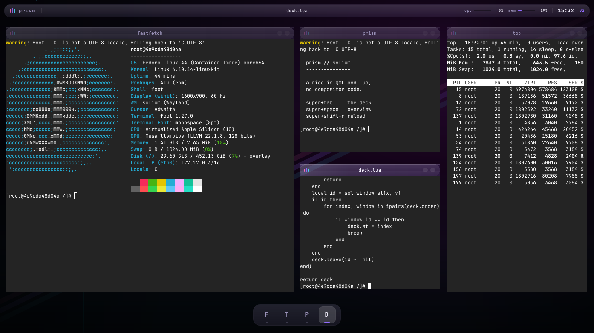
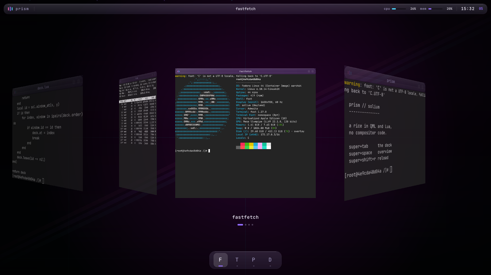
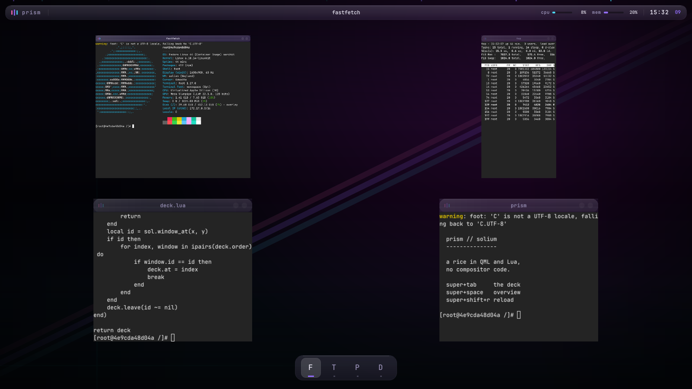

# Prism

A rice for Solium. Frosted glass, violet light, and a deck of windows turned in
three dimensions.

Everything here is QML and Lua. No compositor code was changed to build it, and
none needs to be rebuilt to use it — which is the claim the whole thing is
meant to test.

## The deck

`super+tab`. Every window becomes a card in a carousel: the selected one
centred and face-on, its neighbours turned toward it and receding, the far ones
falling away into the dark.

That is `deck.lua`, and it is about a hundred and thirty lines over
`sol.present`. The compositor already knew how to put a window's texture
somewhere other than its real geometry, with `rotate_y` and `perspective` and
an animation clock to get it there; a cover flow is that, arranged. Nothing in
`crates/` knows a deck exists.

`docs/architecture.md` says the test of the transform layer is whether a new
mode needs new Rust. This one did not.

| | |
|---|---|
| `super+tab` | enter, and step forward |
| `super+shift+tab` | step back |
| `return` | take the selected window |
| `escape` | leave it where it was |
| click a card | take that one |

Clicking works because hit-testing follows the transform: `sol.window_at`
answers for where a window is *drawn*, so a card can be clicked while it is
turned fifty-two degrees and half transparent, and the script never learns that
is what it is looking at.

## What is in here

| file | |
|---|---|
| `init.lua` | the entry point. Nearly the shipped one, plus four lines |
| `user.lua` | the settings: gaps, decoration, motion |
| `prism.lua` | the metrics two other files have to agree about |
| `monitors.lua` | the shipped module, replaced, insetting the work area |
| `shell.lua` | places the bar and the dock, answers what they ask for |
| `deck.lua` | the switcher |
| `qml/Solium/Theme.qml` | the palette everything reads |
| `qml/wallpaper.qml` | three light pools, a prism, and twelve motes |
| `qml/Glow.qml` | a soft circular light, built out of rectangles |
| `qml/decorations/glass.qml` | the window frame |
| `qml/bar.qml` | the bar: window title, CPU, memory, clock |
| `qml/dock.qml` | the dock: a tile per window, click to focus |
| `qml/deck-scrim.qml` | the deck's backdrop, under the windows |
| `qml/deck-caption.qml` | the deck's caption, over them |

Overview (`super+space`) is the shipped one, unmodified. It lands inside the
bar and the dock because `monitors.lua` was replaced rather than each layout —
that module is where every mode reads its area, so insetting it once covers
tiling, scrolling, overview and the deck, including modes written later.

## Installing it

    ln -s "$PWD/rice/prism" ~/.config/solium

Then `solium --check` to see that it loads, and `super+shift+r` in a running
session to pick up an edit without logging out.

## Four things worth knowing before you edit it

**`Canvas` does not work.** The obvious way to draw a radial light is
`Canvas` and `createRadialGradient`, and in the compositor's QML host `onPaint`
is never called — the scene is rasterised offscreen with no scene-graph render
loop to drive it. An unpainted `Canvas` is not empty, it is *white*, so the
symptom is the entire desktop turning white with no error anywhere. `Glow.qml`
is what replaced it: concentric rectangles whose alpha compounds to the same
curve.

**There is no blur behind the glass.** A decoration is composited over the
scene and cannot sample what is under it; there is no `backdrop-filter` here
and Qt is on its software rasteriser besides. The frost is built rather than
sampled — a translucent fill, a lit top edge, a dark bottom edge, a tint — and
the wallpaper's job is to give it something to vary against. That is why the
light pools are placed where the panels are.

**An interactive surface swallows every press inside its rectangle**, whether
or not the QML under the pointer wanted it. That is why `shell.lua` sizes the
dock to the number of windows instead of giving it the width of the screen: a
full-width strip would look identical and make the bottom of the display
unclickable.

**`ToplevelManager.toplevels` is `{ values: [...] }`**, not a list — the
compatibility layer matches how Quickshell's object models present themselves.
Binding a `Repeater` straight at it gives it a map, which is not empty and not
iterable, so the model silently has no items. The list also arrives in
stacking order, so the scenes sort by `id`: without that the dock's tiles jump
sideways every time you change window.

## Two things upstream

**The user's QML directory is searched last, not first.** `host.cpp` walks the
colon-separated import path calling `QQmlEngine::addImportPath`, and that
*prepends* — so the compositor's own `user:own:compat` ends up searched
compat-first, and a `Solium/Theme.qml` dropped in `~/.config/solium/qml` loses
to the shipped one. `docs/ricing.md` promises the opposite ("Your directory is
searched first in every case"), and the failure is silent: the theme simply
does nothing. Until it is fixed, set the path yourself, backwards:

    SOLIUM_QML_PATH=…/qml/compat:…/qml:~/.config/solium/qml

The fix is to walk the list in reverse in `host.cpp`.

**The window list is only published when `SOLIUM_SHELL_SCENE` is set.**
`publish_windows` returns early otherwise, so `ToplevelManager` is empty and
the bar, the dock and the deck's caption all come up blank. The variable does
not need to name anything this rice uses — `SOLIUM_SHELL_SCENE=prism` is
enough — but a scripted surface that reads the window list has no way to ask
for it.
